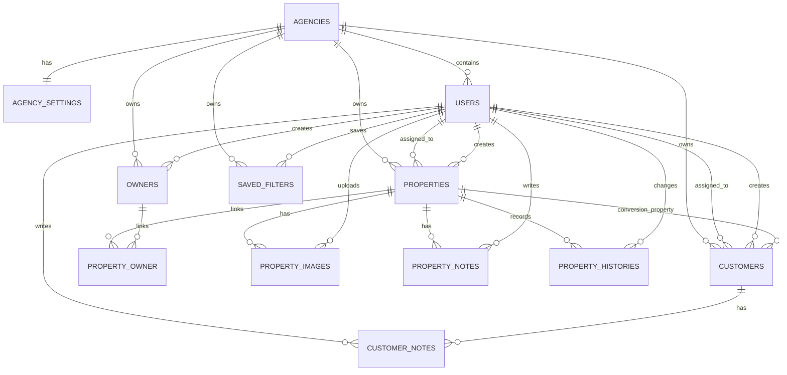
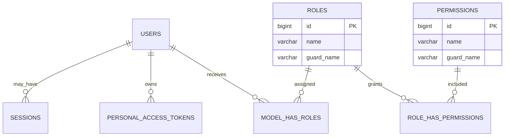

# Real Estate Agency CRM — MVP Database Design

**Document version:** 1.0  
**Schema target:** MVP 0.1  
**Database:** MySQL 8.4 LTS / InnoDB  
**Status:** Implementation baseline  
**Last updated:** 2026-07-25

## 1. Purpose and Authority

This document defines the executable relational design for the MVP. It specifies tables, columns, types, nullability, keys, constraints, indexes, relationships, deletion behavior, migration order, seeding order, and integrity rules.

It contains no Enterprise-only tables or fields. Future schema concepts remain in `PROJECT_SPEC_ENTERPRISE.md`.

If an implementation change requires a schema that differs from this document, update and approve this document before merging the migration.

## 2. Database Conventions

### 2.1 Engine and character set

- Engine: `InnoDB`
- Character set: `utf8mb4`
- Default collation: `utf8mb4_0900_ai_ci`
- Timezone: UTC at the connection and storage layers
- Timestamp precision: microseconds using `DATETIME(6)` / Laravel `timestamps(6)`
- Primary keys: unsigned 64-bit auto-increment integers unless a package contract specifies otherwise
- Foreign-key columns use the same unsigned type as their parent

The selected collation supports case/accent-insensitive general lookup. Application normalization remains required for email, phone, and Property code.

### 2.2 Naming

- Tables are plural `snake_case`.
- Columns are `snake_case`.
- Foreign keys are `<entity>_id`.
- Index and constraint names are explicit and descriptive.
- Booleans use `BOOLEAN` (stored by MySQL as `TINYINT(1)`).
- Domain enums use `VARCHAR` plus application backed enums and `CHECK` constraints.

### 2.3 Nullability

`NULL` means unknown or not applicable. Empty strings are not used as a substitute. Request normalization converts blank optional input to `NULL`.

### 2.4 Money and measurements

- Money: `DECIMAL(15,2)`, returned through the API as a string.
- Area: `DECIMAL(10,2)`.
- Ownership percentage: `DECIMAL(5,2)`.
- Coordinates: `DECIMAL(10,7)`.
- Floating-point columns are prohibited for money and measurements.

### 2.5 Tenant key pattern

Every tenant-owned table has non-null `agency_id`.

Core tenant parents expose:

```sql
UNIQUE KEY uq_<table>_agency_id_id (agency_id, id)
```

Child tables use composite foreign keys such as:

```sql
FOREIGN KEY (agency_id, property_id)
  REFERENCES properties (agency_id, id)
```

This prevents a child row from pointing to a parent in another agency even if application validation fails.

### 2.6 Soft delete pattern

Soft-deletable tables use nullable `deleted_at DATETIME(6)`. Normal queries exclude deleted rows through Eloquent `SoftDeletes`.

Soft delete does not remove foreign-key references. Hard delete is not exposed for operational records in MVP.

## 3. Entity-Relationship Diagrams

### 3.1 Core tenant domain



### 3.2 Identity and authorization



`model_has_permissions` exists because it is part of the supported Spatie schema, but direct user permission assignment is forbidden in MVP.

Spatie's teams feature is disabled. There is no `team_id` column in authorization tables; tenant membership is represented once by `users.agency_id`, and Policies apply tenant/record rules after permission checks.

## 4. Enum and State Catalog

Enums are implemented as PHP backed enums and matching database `CHECK` constraints.

| Domain | Column | Allowed values |
|---|---|---|
| Owner | `owner_type` | `person`, `company` |
| Property | `property_type` | `apartment`, `house`, `villa`, `land`, `office`, `commercial`, `warehouse`, `other` |
| Property | `transaction_type` | `sale`, `rent` |
| Property | `status` | `available`, `reserved`, `sold`, `rented`, `archived` |
| Property history | `action` | `created`, `updated`, `status_changed`, `archived`, `unarchived`, `deleted`, `restored`, `owners_changed`, `assignment_changed`, `images_changed` |
| Customer | `intent` | `buy`, `rent` |
| Customer | `status` | `active`, `inactive`, `converted`, `lost` |
| Customer | `preferred_contact_method` | `phone`, `email` |
| Saved Filter | `module` | `properties`, `owners`, `customers` |

Adding a value requires:

1. Updated application enum and transition/validation logic.
2. A forward migration that replaces the relevant `CHECK`.
3. API/Flutter compatibility review.
4. Updated seed/factory/test data.

## 5. Table Definitions

## 5.1 `agencies`

Tenant root and platform provisioning record.

| Column | Type | Null | Default | Notes |
|---|---|---:|---|---|
| `id` | `BIGINT UNSIGNED` | No | auto | Primary key. |
| `name` | `VARCHAR(150)` | No | — | Display name. |
| `slug` | `VARCHAR(100)` | No | — | Lowercase immutable platform identifier. |
| `email` | `VARCHAR(254)` | No | — | Normalized lowercase. |
| `phone` | `VARCHAR(32)` | No | — | Canonical normalized representation. |
| `address_line_1` | `VARCHAR(255)` | No | — | |
| `address_line_2` | `VARCHAR(255)` | Yes | `NULL` | |
| `city` | `VARCHAR(100)` | No | — | |
| `province` | `VARCHAR(100)` | No | — | |
| `postal_code` | `VARCHAR(32)` | Yes | `NULL` | |
| `country_code` | `CHAR(2)` | No | — | ISO 3166-1 alpha-2 uppercase. |
| `timezone` | `VARCHAR(64)` | No | — | Valid IANA timezone. |
| `locale` | `VARCHAR(10)` | No | — | BCP 47-compatible application locale. |
| `currency_code` | `CHAR(3)` | No | — | ISO 4217 uppercase. |
| `is_active` | `BOOLEAN` | No | `FALSE` | Provisioning/suspension gate. |
| `activated_at` | `DATETIME(6)` | Yes | `NULL` | Set on first activation. |
| `created_at` | `DATETIME(6)` | Yes | `NULL` | Laravel timestamp. |
| `updated_at` | `DATETIME(6)` | Yes | `NULL` | Laravel timestamp. |

Keys and indexes:

```text
PRIMARY KEY (id)
UNIQUE uq_agencies_slug (slug)
INDEX idx_agencies_active_name (is_active, name)
INDEX idx_agencies_created_at (created_at)
```

Constraints:

- `slug` matches `^[a-z0-9]+(?:-[a-z0-9]+)*$`.
- `country_code` and `currency_code` are uppercase.
- If `is_active = TRUE`, `activated_at IS NOT NULL`.

Deletion: no soft delete and no MVP delete operation. Suspension uses `is_active = FALSE`.

## 5.2 `agency_settings`

One-to-one operational settings required by the MVP.

| Column | Type | Null | Default | Notes |
|---|---|---:|---|---|
| `agency_id` | `BIGINT UNSIGNED` | No | — | Primary and foreign key. |
| `property_code_prefix` | `VARCHAR(8)` | No | — | Uppercase ASCII/alphanumeric, 2–8 characters. |
| `next_property_sequence` | `BIGINT UNSIGNED` | No | `1` | Locked and incremented when a Property is created. |
| `default_page_size` | `TINYINT UNSIGNED` | No | `25` | One of 10, 25, 50, 100. |
| `created_at` | `DATETIME(6)` | Yes | `NULL` | |
| `updated_at` | `DATETIME(6)` | Yes | `NULL` | |

Keys and constraints:

```text
PRIMARY KEY (agency_id)
CONSTRAINT fk_agency_settings_agency
  FOREIGN KEY (agency_id) REFERENCES agencies(id) ON DELETE CASCADE
CHECK (next_property_sequence >= 1)
CHECK (default_page_size IN (10, 25, 50, 100))
```

The code prefix becomes immutable after the agency's first Property exists.

## 5.3 `users`

All web/mobile identities. Role is stored only through Spatie role tables.

| Column | Type | Null | Default | Notes |
|---|---|---:|---|---|
| `id` | `BIGINT UNSIGNED` | No | auto | Primary key. |
| `agency_id` | `BIGINT UNSIGNED` | Yes | `NULL` | Null only for Super Admin. |
| `name` | `VARCHAR(150)` | No | — | |
| `email` | `VARCHAR(254)` | No | — | Lowercase; globally unique. |
| `phone` | `VARCHAR(32)` | Yes | `NULL` | Canonical normalized value. |
| `password` | `VARCHAR(255)` | No | — | Framework password hash. |
| `is_active` | `BOOLEAN` | No | `TRUE` | |
| `must_change_password` | `BOOLEAN` | No | `FALSE` | Set after administrator reset. |
| `last_login_at` | `DATETIME(6)` | Yes | `NULL` | Operational convenience, not login history. |
| `remember_token` | `VARCHAR(100)` | Yes | `NULL` | Laravel web auth. |
| `created_at` | `DATETIME(6)` | Yes | `NULL` | |
| `updated_at` | `DATETIME(6)` | Yes | `NULL` | |
| `deleted_at` | `DATETIME(6)` | Yes | `NULL` | Soft delete. |

Keys and indexes:

```text
PRIMARY KEY (id)
UNIQUE uq_users_email (email)
UNIQUE uq_users_agency_id_id (agency_id, id)
INDEX idx_users_agency_active_name (agency_id, is_active, name)
INDEX idx_users_agency_deleted (agency_id, deleted_at)
CONSTRAINT fk_users_agency
  FOREIGN KEY (agency_id) REFERENCES agencies(id) ON DELETE RESTRICT
```

Application invariants:

- `super-admin`: `agency_id IS NULL`.
- `agency-manager` and `agent`: `agency_id IS NOT NULL`.
- Exactly one seeded role is assigned.
- `agency_id` is immutable.
- A soft-deleted/deactivated user cannot authenticate.
- Email remains reserved after soft deletion.

Forbidden columns: `role`, `roles`, `permission`, `permissions`, plan, subscription, 2FA, device, or billing fields.

## 5.4 `roles`

Standard Spatie role catalog.

| Column | Type | Null | Default | Notes |
|---|---|---:|---|---|
| `id` | `BIGINT UNSIGNED` | No | auto | Primary key. |
| `name` | `VARCHAR(125)` | No | — | Seeded role name. |
| `guard_name` | `VARCHAR(125)` | No | `web` | Laravel authorization guard. |

```text
PRIMARY KEY (id)
UNIQUE uq_roles_name_guard (name, guard_name)
```

Seeded names: `super-admin`, `agency-manager`, `agent`.

## 5.5 `permissions`

Standard Spatie permission catalog.

| Column | Type | Null | Default |
|---|---|---:|---|
| `id` | `BIGINT UNSIGNED` | No | auto |
| `name` | `VARCHAR(125)` | No | — |
| `guard_name` | `VARCHAR(125)` | No | `web` |

```text
PRIMARY KEY (id)
UNIQUE uq_permissions_name_guard (name, guard_name)
```

Permission names are seeded from `PROJECT_SPEC_MVP.md` and cannot be edited in UI.

## 5.6 `model_has_roles`

Spatie polymorphic role assignments.

| Column | Type | Null | Notes |
|---|---|---:|---|
| `role_id` | `BIGINT UNSIGNED` | No | FK to `roles`. |
| `model_type` | `VARCHAR(255)` | No | Only `App\Models\User` in MVP. |
| `model_id` | `BIGINT UNSIGNED` | No | User ID for MVP. |

```text
PRIMARY KEY (role_id, model_id, model_type)
INDEX idx_model_has_roles_model (model_id, model_type)
FOREIGN KEY (role_id) REFERENCES roles(id) ON DELETE CASCADE
```

Application enforces exactly one role per User.

## 5.7 `role_has_permissions`

Spatie role-to-permission map.

| Column | Type | Null |
|---|---|---:|
| `permission_id` | `BIGINT UNSIGNED` | No |
| `role_id` | `BIGINT UNSIGNED` | No |

```text
PRIMARY KEY (permission_id, role_id)
FOREIGN KEY (permission_id) REFERENCES permissions(id) ON DELETE CASCADE
FOREIGN KEY (role_id) REFERENCES roles(id) ON DELETE CASCADE
```

## 5.8 `model_has_permissions`

Required by the supported Spatie package schema but unused for MVP direct assignments.

| Column | Type | Null |
|---|---|---:|
| `permission_id` | `BIGINT UNSIGNED` | No |
| `model_type` | `VARCHAR(255)` | No |
| `model_id` | `BIGINT UNSIGNED` | No |

```text
PRIMARY KEY (permission_id, model_id, model_type)
INDEX idx_model_has_permissions_model (model_id, model_type)
FOREIGN KEY (permission_id) REFERENCES permissions(id) ON DELETE CASCADE
```

The application and seeders MUST leave this table empty.

## 5.9 `sessions`

Database-backed web sessions for Filament.

| Column | Type | Null | Notes |
|---|---|---:|---|
| `id` | `VARCHAR(255)` | No | Primary key. |
| `user_id` | `BIGINT UNSIGNED` | Yes | Authenticated user when present. |
| `ip_address` | `VARCHAR(45)` | Yes | IPv4/IPv6. |
| `user_agent` | `TEXT` | Yes | |
| `payload` | `LONGTEXT` | No | Laravel session payload. |
| `last_activity` | `INT UNSIGNED` | No | Unix timestamp used by Laravel. |

```text
PRIMARY KEY (id)
INDEX idx_sessions_user_id (user_id)
INDEX idx_sessions_last_activity (last_activity)
FOREIGN KEY (user_id) REFERENCES users(id) ON DELETE SET NULL
```

This is active session storage, not Enterprise device/login history.

## 5.10 `personal_access_tokens`

Laravel Sanctum mobile tokens.

| Column | Type | Null | Notes |
|---|---|---:|---|
| `id` | `BIGINT UNSIGNED` | No | Primary key. |
| `tokenable_type` | `VARCHAR(255)` | No | `App\Models\User` in MVP. |
| `tokenable_id` | `BIGINT UNSIGNED` | No | User ID. |
| `name` | `TEXT` | No | User-recognizable device name. |
| `token` | `CHAR(64)` | No | SHA-256 hash; unique. |
| `abilities` | `TEXT` | Yes | JSON-encoded Sanctum abilities; `mobile`. |
| `last_used_at` | `DATETIME(6)` | Yes | |
| `expires_at` | `DATETIME(6)` | No | Required 30-day expiry in MVP application flow. |
| `created_at` | `DATETIME(6)` | Yes | |
| `updated_at` | `DATETIME(6)` | Yes | |

```text
PRIMARY KEY (id)
UNIQUE uq_personal_access_tokens_token (token)
INDEX idx_personal_access_tokens_owner (tokenable_type, tokenable_id)
INDEX idx_personal_access_tokens_expires (expires_at)
```

No plaintext token is stored.

## 5.11 `owners`

Tenant-owned persons or companies that own Properties.

| Column | Type | Null | Default | Notes |
|---|---|---:|---|---|
| `id` | `BIGINT UNSIGNED` | No | auto | |
| `agency_id` | `BIGINT UNSIGNED` | No | — | Tenant key. |
| `owner_type` | `VARCHAR(20)` | No | — | `person` or `company`. |
| `first_name` | `VARCHAR(100)` | Yes | `NULL` | Required for person. |
| `last_name` | `VARCHAR(100)` | Yes | `NULL` | Required for person. |
| `company_name` | `VARCHAR(180)` | Yes | `NULL` | Required for company. |
| `mobile` | `VARCHAR(32)` | Yes | `NULL` | Canonical normalized value. |
| `phone` | `VARCHAR(32)` | Yes | `NULL` | Canonical normalized value. |
| `email` | `VARCHAR(254)` | Yes | `NULL` | Lowercase. |
| `identity_number_encrypted` | `TEXT` | Yes | `NULL` | Laravel encrypted cast; not searchable. |
| `address_line_1` | `VARCHAR(255)` | Yes | `NULL` | |
| `address_line_2` | `VARCHAR(255)` | Yes | `NULL` | |
| `city` | `VARCHAR(100)` | Yes | `NULL` | |
| `province` | `VARCHAR(100)` | Yes | `NULL` | |
| `postal_code` | `VARCHAR(32)` | Yes | `NULL` | |
| `notes` | `TEXT` | Yes | `NULL` | Plain-text general owner note. |
| `created_by_user_id` | `BIGINT UNSIGNED` | No | — | Same-agency User. |
| `created_at` | `DATETIME(6)` | Yes | `NULL` | |
| `updated_at` | `DATETIME(6)` | Yes | `NULL` | |
| `deleted_at` | `DATETIME(6)` | Yes | `NULL` | Soft delete. |

Keys and indexes:

```text
PRIMARY KEY (id)
UNIQUE uq_owners_agency_id_id (agency_id, id)
INDEX idx_owners_agency_person_name (agency_id, last_name, first_name)
INDEX idx_owners_agency_company (agency_id, company_name)
INDEX idx_owners_agency_mobile (agency_id, mobile)
INDEX idx_owners_agency_email (agency_id, email)
INDEX idx_owners_agency_deleted (agency_id, deleted_at)
FOREIGN KEY (agency_id) REFERENCES agencies(id) ON DELETE RESTRICT
FOREIGN KEY (agency_id, created_by_user_id)
  REFERENCES users(agency_id, id) ON DELETE RESTRICT
CHECK (owner_type IN ('person', 'company'))
CHECK (
  (owner_type = 'person' AND first_name IS NOT NULL AND last_name IS NOT NULL)
  OR
  (owner_type = 'company' AND company_name IS NOT NULL)
)
CHECK (mobile IS NOT NULL OR phone IS NOT NULL OR email IS NOT NULL)
```

Duplicate contact values are allowed; automated duplicate detection is Enterprise scope.

## 5.12 `properties`

Primary tenant inventory record.

| Column | Type | Null | Default | Notes |
|---|---|---:|---|---|
| `id` | `BIGINT UNSIGNED` | No | auto | |
| `agency_id` | `BIGINT UNSIGNED` | No | — | Tenant key. |
| `code` | `VARCHAR(32)` | No | — | Immutable agency-generated code. |
| `title` | `VARCHAR(200)` | No | — | |
| `description` | `TEXT` | Yes | `NULL` | Plain text in MVP. |
| `property_type` | `VARCHAR(32)` | No | — | Enum catalog. |
| `transaction_type` | `VARCHAR(16)` | No | — | `sale` or `rent`. |
| `status` | `VARCHAR(16)` | No | `available` | State enum. |
| `assigned_agent_id` | `BIGINT UNSIGNED` | Yes | `NULL` | Same-agency Agent. |
| `created_by_user_id` | `BIGINT UNSIGNED` | No | — | Same-agency User. |
| `currency_code` | `CHAR(3)` | No | — | Copied from Agency at creation; immutable. |
| `sale_price` | `DECIMAL(15,2)` | Yes | `NULL` | Required for sale. |
| `deposit_amount` | `DECIMAL(15,2)` | Yes | `NULL` | Rental deposit; zero allowed. |
| `monthly_rent` | `DECIMAL(15,2)` | Yes | `NULL` | Required for rent. |
| `area_sqm` | `DECIMAL(10,2)` | Yes | `NULL` | Positive when present. |
| `bedrooms` | `TINYINT UNSIGNED` | Yes | `NULL` | |
| `bathrooms` | `TINYINT UNSIGNED` | Yes | `NULL` | |
| `floor_number` | `SMALLINT` | Yes | `NULL` | May be negative for basement. |
| `total_floors` | `SMALLINT UNSIGNED` | Yes | `NULL` | |
| `year_built` | `SMALLINT UNSIGNED` | Yes | `NULL` | Application validates plausible range. |
| `parking_spaces` | `TINYINT UNSIGNED` | No | `0` | |
| `has_storage_room` | `BOOLEAN` | No | `FALSE` | |
| `has_elevator` | `BOOLEAN` | No | `FALSE` | |
| `has_balcony` | `BOOLEAN` | No | `FALSE` | |
| `city` | `VARCHAR(100)` | No | — | |
| `district` | `VARCHAR(100)` | Yes | `NULL` | |
| `street_address` | `VARCHAR(500)` | No | — | |
| `postal_code` | `VARCHAR(32)` | Yes | `NULL` | |
| `latitude` | `DECIMAL(10,7)` | Yes | `NULL` | |
| `longitude` | `DECIMAL(10,7)` | Yes | `NULL` | |
| `available_from` | `DATE` | Yes | `NULL` | |
| `closed_at` | `DATETIME(6)` | Yes | `NULL` | Required for sold/rented. |
| `archived_at` | `DATETIME(6)` | Yes | `NULL` | Required for archived. |
| `created_at` | `DATETIME(6)` | Yes | `NULL` | |
| `updated_at` | `DATETIME(6)` | Yes | `NULL` | Optimistic concurrency value. |
| `deleted_at` | `DATETIME(6)` | Yes | `NULL` | Soft delete. |

Keys and indexes:

```text
PRIMARY KEY (id)
UNIQUE uq_properties_agency_id_id (agency_id, id)
UNIQUE uq_properties_agency_code (agency_id, code)
INDEX idx_properties_agency_status_updated (agency_id, status, updated_at, id)
INDEX idx_properties_agency_type_transaction (agency_id, property_type, transaction_type)
INDEX idx_properties_agency_agent_status (agency_id, assigned_agent_id, status)
INDEX idx_properties_agency_city_district (agency_id, city, district)
INDEX idx_properties_agency_sale_price (agency_id, transaction_type, sale_price)
INDEX idx_properties_agency_monthly_rent (agency_id, transaction_type, monthly_rent)
INDEX idx_properties_agency_area (agency_id, area_sqm)
INDEX idx_properties_agency_deleted (agency_id, deleted_at)
FOREIGN KEY (agency_id) REFERENCES agencies(id) ON DELETE RESTRICT
FOREIGN KEY (agency_id, assigned_agent_id)
  REFERENCES users(agency_id, id) ON DELETE RESTRICT
FOREIGN KEY (agency_id, created_by_user_id)
  REFERENCES users(agency_id, id) ON DELETE RESTRICT
```

Checks:

```sql
CHECK (property_type IN (
  'apartment', 'house', 'villa', 'land',
  'office', 'commercial', 'warehouse', 'other'
));
CHECK (transaction_type IN ('sale', 'rent'));
CHECK (status IN ('available', 'reserved', 'sold', 'rented', 'archived'));
CHECK (sale_price IS NULL OR sale_price > 0);
CHECK (deposit_amount IS NULL OR deposit_amount >= 0);
CHECK (monthly_rent IS NULL OR monthly_rent > 0);
CHECK (area_sqm IS NULL OR area_sqm > 0);
CHECK (
  (transaction_type = 'sale'
    AND sale_price IS NOT NULL
    AND deposit_amount IS NULL
    AND monthly_rent IS NULL)
  OR
  (transaction_type = 'rent'
    AND sale_price IS NULL
    AND monthly_rent IS NOT NULL
    AND deposit_amount IS NOT NULL)
);
CHECK (
  (status = 'sold' AND transaction_type = 'sale' AND closed_at IS NOT NULL)
  OR
  (status = 'rented' AND transaction_type = 'rent' AND closed_at IS NOT NULL)
  OR
  (status NOT IN ('sold', 'rented') AND closed_at IS NULL)
);
CHECK (
  (status = 'archived' AND archived_at IS NOT NULL)
  OR
  (status <> 'archived' AND archived_at IS NULL)
);
CHECK (latitude IS NULL OR latitude BETWEEN -90 AND 90);
CHECK (longitude IS NULL OR longitude BETWEEN -180 AND 180);
CHECK (
  (latitude IS NULL AND longitude IS NULL)
  OR
  (latitude IS NOT NULL AND longitude IS NOT NULL)
);
CHECK (
  floor_number IS NULL
  OR total_floors IS NULL
  OR floor_number <= total_floors
);
```

Application-only invariants:

- At least one Owner link exists before the creation transaction commits.
- Exactly one linked Owner is primary.
- `assigned_agent_id`, when present, has the Agent role and is active at assignment time.
- Code and currency are immutable.
- Status transitions follow `PROJECT_SPEC_MVP.md`.

## 5.13 `property_owner`

Tenant-safe many-to-many relationship between Properties and Owners.

| Column | Type | Null | Default | Notes |
|---|---|---:|---|---|
| `agency_id` | `BIGINT UNSIGNED` | No | — | Tenant key. |
| `property_id` | `BIGINT UNSIGNED` | No | — | |
| `owner_id` | `BIGINT UNSIGNED` | No | — | |
| `ownership_percentage` | `DECIMAL(5,2)` | Yes | `NULL` | 0.01–100.00 when present. |
| `is_primary` | `BOOLEAN` | No | `FALSE` | Exactly one per Property by Service invariant. |
| `created_at` | `DATETIME(6)` | Yes | `NULL` | |
| `updated_at` | `DATETIME(6)` | Yes | `NULL` | |

```text
PRIMARY KEY (agency_id, property_id, owner_id)
INDEX idx_property_owner_owner (agency_id, owner_id, property_id)
INDEX idx_property_owner_primary (agency_id, property_id, is_primary)
FOREIGN KEY (agency_id, property_id)
  REFERENCES properties(agency_id, id) ON DELETE RESTRICT
FOREIGN KEY (agency_id, owner_id)
  REFERENCES owners(agency_id, id) ON DELETE RESTRICT
CHECK (
  ownership_percentage IS NULL
  OR ownership_percentage BETWEEN 0.01 AND 100.00
)
```

Service invariants:

- One and only one `is_primary = TRUE` per Property.
- If all shares are supplied, the total equals exactly `100.00`.
- Mixed known/unknown shares are rejected; either every link has a percentage or none does.
- Link changes and Property History are committed together.

## 5.14 `property_images`

Metadata for private local image objects.

| Column | Type | Null | Default | Notes |
|---|---|---:|---|---|
| `id` | `BIGINT UNSIGNED` | No | auto | |
| `agency_id` | `BIGINT UNSIGNED` | No | — | Tenant key. |
| `property_id` | `BIGINT UNSIGNED` | No | — | |
| `uploaded_by_user_id` | `BIGINT UNSIGNED` | No | — | |
| `storage_path` | `VARCHAR(500)` | No | — | Private generated relative path. |
| `original_name` | `VARCHAR(255)` | No | — | Metadata only; never used as path. |
| `mime_type` | `VARCHAR(100)` | No | — | Server-derived. |
| `size_bytes` | `BIGINT UNSIGNED` | No | — | Maximum 10 MiB in MVP. |
| `width` | `INT UNSIGNED` | No | — | Decoded pixel width. |
| `height` | `INT UNSIGNED` | No | — | Decoded pixel height. |
| `sort_order` | `SMALLINT UNSIGNED` | No | `0` | Transactionally normalized. |
| `is_cover` | `BOOLEAN` | No | `FALSE` | At most one active cover. |
| `created_at` | `DATETIME(6)` | Yes | `NULL` | |
| `updated_at` | `DATETIME(6)` | Yes | `NULL` | |
| `deleted_at` | `DATETIME(6)` | Yes | `NULL` | Soft delete. |

```text
PRIMARY KEY (id)
UNIQUE uq_property_images_agency_id_id (agency_id, id)
UNIQUE uq_property_images_storage_path (storage_path)
INDEX idx_property_images_property_order
  (agency_id, property_id, deleted_at, sort_order)
INDEX idx_property_images_property_cover
  (agency_id, property_id, deleted_at, is_cover)
FOREIGN KEY (agency_id, property_id)
  REFERENCES properties(agency_id, id) ON DELETE RESTRICT
FOREIGN KEY (agency_id, uploaded_by_user_id)
  REFERENCES users(agency_id, id) ON DELETE RESTRICT
CHECK (mime_type IN ('image/jpeg', 'image/png', 'image/webp'))
CHECK (size_bytes BETWEEN 1 AND 10485760)
CHECK (width > 0 AND height > 0)
```

MySQL cannot express "one active cover" cleanly with nullable soft-delete semantics. The Service locks active image rows, enforces one cover, and normalizes unique active `sort_order` values in one transaction.

## 5.15 `property_notes`

Internal plain-text notes.

| Column | Type | Null | Default |
|---|---|---:|---|
| `id` | `BIGINT UNSIGNED` | No | auto |
| `agency_id` | `BIGINT UNSIGNED` | No | — |
| `property_id` | `BIGINT UNSIGNED` | No | — |
| `author_user_id` | `BIGINT UNSIGNED` | No | — |
| `body` | `TEXT` | No | — |
| `created_at` | `DATETIME(6)` | Yes | `NULL` |
| `updated_at` | `DATETIME(6)` | Yes | `NULL` |
| `deleted_at` | `DATETIME(6)` | Yes | `NULL` |

```text
PRIMARY KEY (id)
UNIQUE uq_property_notes_agency_id_id (agency_id, id)
INDEX idx_property_notes_property_created
  (agency_id, property_id, deleted_at, created_at)
INDEX idx_property_notes_author (agency_id, author_user_id, created_at)
FOREIGN KEY (agency_id, property_id)
  REFERENCES properties(agency_id, id) ON DELETE RESTRICT
FOREIGN KEY (agency_id, author_user_id)
  REFERENCES users(agency_id, id) ON DELETE RESTRICT
CHECK (CHAR_LENGTH(TRIM(body)) BETWEEN 1 AND 5000)
```

## 5.16 `property_histories`

Immutable basic operational history. This is not the Enterprise audit log.

| Column | Type | Null | Default | Notes |
|---|---|---:|---|---|
| `id` | `BIGINT UNSIGNED` | No | auto | |
| `agency_id` | `BIGINT UNSIGNED` | No | — | |
| `property_id` | `BIGINT UNSIGNED` | No | — | |
| `changed_by_user_id` | `BIGINT UNSIGNED` | No | — | |
| `action` | `VARCHAR(32)` | No | — | Enum catalog. |
| `from_status` | `VARCHAR(16)` | Yes | `NULL` | Set for status change when applicable. |
| `to_status` | `VARCHAR(16)` | Yes | `NULL` | Set for status change when applicable. |
| `changed_fields` | `JSON` | Yes | `NULL` | Allowlisted old/new scalar values. |
| `reason` | `VARCHAR(1000)` | Yes | `NULL` | Required by selected transitions. |
| `occurred_at` | `DATETIME(6)` | No | `CURRENT_TIMESTAMP(6)` | Immutable event time. |

```text
PRIMARY KEY (id)
UNIQUE uq_property_histories_agency_id_id (agency_id, id)
INDEX idx_property_histories_property_time
  (agency_id, property_id, occurred_at, id)
INDEX idx_property_histories_actor_time
  (agency_id, changed_by_user_id, occurred_at)
INDEX idx_property_histories_action_time
  (agency_id, action, occurred_at)
FOREIGN KEY (agency_id, property_id)
  REFERENCES properties(agency_id, id) ON DELETE RESTRICT
FOREIGN KEY (agency_id, changed_by_user_id)
  REFERENCES users(agency_id, id) ON DELETE RESTRICT
CHECK (action IN (
  'created', 'updated', 'status_changed', 'archived', 'unarchived',
  'deleted', 'restored', 'owners_changed', 'assignment_changed',
  'images_changed'
))
CHECK (from_status IS NULL OR from_status IN (
  'available', 'reserved', 'sold', 'rented', 'archived'
))
CHECK (to_status IS NULL OR to_status IN (
  'available', 'reserved', 'sold', 'rented', 'archived'
))
```

There are no `updated_at` or `deleted_at` columns. Application code forbids update/delete.

`changed_fields` MUST NOT include passwords, tokens, identity numbers, image data, storage paths, or unbounded text bodies. Shape:

```json
{
  "title": {
    "old": "Old title",
    "new": "New title"
  }
}
```

## 5.17 `customers`

Buyer/renter leads.

| Column | Type | Null | Default | Notes |
|---|---|---:|---|---|
| `id` | `BIGINT UNSIGNED` | No | auto | |
| `agency_id` | `BIGINT UNSIGNED` | No | — | Tenant key. |
| `assigned_agent_id` | `BIGINT UNSIGNED` | No | — | Same-agency Agent. |
| `created_by_user_id` | `BIGINT UNSIGNED` | No | — | Same-agency User. |
| `first_name` | `VARCHAR(100)` | No | — | |
| `last_name` | `VARCHAR(100)` | No | — | |
| `mobile` | `VARCHAR(32)` | No | — | Canonical normalized value. |
| `phone` | `VARCHAR(32)` | Yes | `NULL` | |
| `email` | `VARCHAR(254)` | Yes | `NULL` | Lowercase. |
| `preferred_contact_method` | `VARCHAR(16)` | No | `phone` | `phone` or `email`. |
| `intent` | `VARCHAR(16)` | No | — | `buy` or `rent`. |
| `status` | `VARCHAR(16)` | No | `active` | |
| `preferred_property_types` | `JSON` | Yes | `NULL` | Array of unique Property type strings. |
| `budget_min` | `DECIMAL(15,2)` | Yes | `NULL` | |
| `budget_max` | `DECIMAL(15,2)` | Yes | `NULL` | |
| `desired_city` | `VARCHAR(100)` | Yes | `NULL` | |
| `desired_district` | `VARCHAR(100)` | Yes | `NULL` | |
| `min_area_sqm` | `DECIMAL(10,2)` | Yes | `NULL` | |
| `max_area_sqm` | `DECIMAL(10,2)` | Yes | `NULL` | |
| `min_bedrooms` | `TINYINT UNSIGNED` | Yes | `NULL` | |
| `converted_property_id` | `BIGINT UNSIGNED` | Yes | `NULL` | Same-agency Property. |
| `created_at` | `DATETIME(6)` | Yes | `NULL` | |
| `updated_at` | `DATETIME(6)` | Yes | `NULL` | Optimistic concurrency value. |
| `deleted_at` | `DATETIME(6)` | Yes | `NULL` | Soft delete. |

Keys and indexes:

```text
PRIMARY KEY (id)
UNIQUE uq_customers_agency_id_id (agency_id, id)
INDEX idx_customers_agency_agent_status
  (agency_id, assigned_agent_id, status, updated_at)
INDEX idx_customers_agency_name (agency_id, last_name, first_name)
INDEX idx_customers_agency_mobile (agency_id, mobile)
INDEX idx_customers_agency_email (agency_id, email)
INDEX idx_customers_agency_intent_status (agency_id, intent, status)
INDEX idx_customers_agency_budget (agency_id, intent, budget_min, budget_max)
INDEX idx_customers_agency_location (agency_id, desired_city, desired_district)
INDEX idx_customers_agency_deleted (agency_id, deleted_at)
FOREIGN KEY (agency_id) REFERENCES agencies(id) ON DELETE RESTRICT
FOREIGN KEY (agency_id, assigned_agent_id)
  REFERENCES users(agency_id, id) ON DELETE RESTRICT
FOREIGN KEY (agency_id, created_by_user_id)
  REFERENCES users(agency_id, id) ON DELETE RESTRICT
FOREIGN KEY (agency_id, converted_property_id)
  REFERENCES properties(agency_id, id) ON DELETE RESTRICT
```

Checks:

```sql
CHECK (preferred_contact_method IN ('phone', 'email'));
CHECK (intent IN ('buy', 'rent'));
CHECK (status IN ('active', 'inactive', 'converted', 'lost'));
CHECK (budget_min IS NULL OR budget_min >= 0);
CHECK (budget_max IS NULL OR budget_max >= 0);
CHECK (budget_min IS NULL OR budget_max IS NULL OR budget_min <= budget_max);
CHECK (min_area_sqm IS NULL OR min_area_sqm > 0);
CHECK (max_area_sqm IS NULL OR max_area_sqm > 0);
CHECK (
  min_area_sqm IS NULL OR max_area_sqm IS NULL OR min_area_sqm <= max_area_sqm
);
CHECK (
  (preferred_contact_method = 'phone')
  OR
  (preferred_contact_method = 'email' AND email IS NOT NULL)
);
CHECK (
  (status = 'converted' AND converted_property_id IS NOT NULL)
  OR
  (status <> 'converted' AND converted_property_id IS NULL)
);
```

Application invariants:

- Assigned user has Agent role and is active at assignment time.
- Preferred Property type JSON is an array of unique allowed values.
- Conversion Property transaction matches Customer intent: `buy → sale`, `rent → rent`.
- Agent updates are limited to the current Agent's assigned Customers.

## 5.18 `customer_notes`

Internal Customer notes.

| Column | Type | Null | Default |
|---|---|---:|---|
| `id` | `BIGINT UNSIGNED` | No | auto |
| `agency_id` | `BIGINT UNSIGNED` | No | — |
| `customer_id` | `BIGINT UNSIGNED` | No | — |
| `author_user_id` | `BIGINT UNSIGNED` | No | — |
| `body` | `TEXT` | No | — |
| `created_at` | `DATETIME(6)` | Yes | `NULL` |
| `updated_at` | `DATETIME(6)` | Yes | `NULL` |
| `deleted_at` | `DATETIME(6)` | Yes | `NULL` |

```text
PRIMARY KEY (id)
UNIQUE uq_customer_notes_agency_id_id (agency_id, id)
INDEX idx_customer_notes_customer_created
  (agency_id, customer_id, deleted_at, created_at)
INDEX idx_customer_notes_author (agency_id, author_user_id, created_at)
FOREIGN KEY (agency_id, customer_id)
  REFERENCES customers(agency_id, id) ON DELETE RESTRICT
FOREIGN KEY (agency_id, author_user_id)
  REFERENCES users(agency_id, id) ON DELETE RESTRICT
CHECK (CHAR_LENGTH(TRIM(body)) BETWEEN 1 AND 5000)
```

## 5.19 `saved_filters`

Server-validated user filter definitions.

| Column | Type | Null | Default | Notes |
|---|---|---:|---|---|
| `id` | `BIGINT UNSIGNED` | No | auto | |
| `agency_id` | `BIGINT UNSIGNED` | No | — | Tenant key. |
| `user_id` | `BIGINT UNSIGNED` | No | — | Owner. |
| `module` | `VARCHAR(32)` | No | — | Enum catalog. |
| `name` | `VARCHAR(100)` | No | — | Unique per user/module. |
| `filters` | `JSON` | No | — | Validated key/value object. |
| `sort` | `VARCHAR(64)` | Yes | `NULL` | One allowlisted sort expression. |
| `is_default` | `BOOLEAN` | No | `FALSE` | At most one per user/module by Service invariant. |
| `created_at` | `DATETIME(6)` | Yes | `NULL` | |
| `updated_at` | `DATETIME(6)` | Yes | `NULL` | |

```text
PRIMARY KEY (id)
UNIQUE uq_saved_filters_agency_id_id (agency_id, id)
UNIQUE uq_saved_filters_user_module_name (agency_id, user_id, module, name)
INDEX idx_saved_filters_user_module_default
  (agency_id, user_id, module, is_default)
FOREIGN KEY (agency_id, user_id)
  REFERENCES users(agency_id, id) ON DELETE RESTRICT
CHECK (module IN ('properties', 'owners', 'customers'))
CHECK (CHAR_LENGTH(TRIM(name)) BETWEEN 1 AND 100)
```

Service invariants:

- Maximum 50 rows per user/module.
- At most one default per user/module.
- Filter JSON contains only allowlisted scalar/array values; no SQL, expressions, URLs, or arbitrary columns.
- Delete is a hard delete because this is user preference data with no operational dependency.

## 6. Relationships and Cardinality

| Parent | Child | Cardinality | Integrity rule |
|---|---|---|---|
| Agency | Agency Settings | 1:1 | Settings created in same provisioning transaction. |
| Agency | Users | 1:N | Super Admin is the only user type with no Agency. |
| Agency | Owners/Properties/Customers | 1:N | Non-null tenant key and fail-closed scope. |
| User | Property | 1:N assigned | Assigned User must be an Agent in same Agency. |
| User | Customer | 1:N assigned | Assigned User must be an Agent in same Agency. |
| Property | Owner | N:M | Composite tenant-safe pivot; one primary Owner. |
| Property | Images | 1:N | Maximum 20 active; one cover. |
| Property | Notes | 1:N | Author and parent share Agency. |
| Property | Histories | 1:N | Immutable; transactionally written. |
| Customer | Notes | 1:N | Author and parent share Agency. |
| Customer | Conversion Property | N:1 optional | Same Agency and transaction-compatible. |
| User | Saved Filters | 1:N | User-owned only. |
| User | Roles | N:M package shape | Exactly one role per User by application invariant. |
| Role | Permissions | N:M | Seeded deterministic map. |

## 7. Data-Integrity Rules Not Fully Expressible in MySQL

The following MUST be enforced in Services and covered by transaction/integration tests:

1. A User's role matches whether `agency_id` is null.
2. A tenant User has exactly one role; direct permissions remain empty.
3. Assigned Users have the Agent role.
4. A new Property has at least one Owner and exactly one primary Owner at commit.
5. Ownership percentages are all absent or all present and sum to `100.00`.
6. At most one active cover image exists and active sort order is unique.
7. Active Property images do not exceed 20.
8. Property code sequence is consumed under an agency-settings row lock.
9. Property status transitions follow the state machine.
10. Saved Filters have one default and maximum 50 rows per user/module.
11. Customer conversion Property matches intent.
12. Soft delete/restore dependency rules are satisfied.

Database constraints remain the final guard wherever a relational invariant can be expressed.

## 8. Property Code Concurrency

Required transaction:

```sql
START TRANSACTION;

SELECT property_code_prefix, next_property_sequence
FROM agency_settings
WHERE agency_id = ?
FOR UPDATE;

-- Application formats PREFIX-000001.

UPDATE agency_settings
SET next_property_sequence = next_property_sequence + 1,
    updated_at = CURRENT_TIMESTAMP(6)
WHERE agency_id = ?;

INSERT INTO properties (..., agency_id, code, ...)
VALUES (..., ?, ?, ...);

-- Insert at least one property_owner row and history row.

COMMIT;
```

Rules:

- The sequence is monotonic per Agency.
- A transaction rollback may allow the same sequence value to be retried because the locked increment rolls back.
- A committed code is never reused after soft deletion.
- `UNIQUE (agency_id, code)` handles the final race/implementation defect.
- Deadlock/duplicate exceptions may be retried at most three times.

## 9. Soft Delete, Archive, and Restore

| Table | Soft delete | Archive state | Restore |
|---|---:|---:|---|
| `agencies` | No | No; uses active/suspended | Not applicable |
| `users` | Yes | No; usually deactivate | Platform/manager-controlled |
| `owners` | Yes | No | Manager only; dependency validation |
| `properties` | Yes | Yes (`status=archived`) | Manager only |
| `property_images` | Yes | No | Internal through Property workflow if supported |
| `property_notes` | Yes | No | Manager or author behavior per Policy |
| `property_histories` | No | No | Immutable |
| `customers` | Yes | No | Manager only |
| `customer_notes` | Yes | No | Manager or author behavior per Policy |
| `saved_filters` | No | No | Not required |

Rules:

- Archived rows remain in normal storage and are filterable.
- Soft-deleted rows are excluded from normal scope and mobile API.
- Restoring a Property validates non-deleted Owners and a valid same-agency assigned Agent.
- Restoring a Customer validates assigned Agent and conversion Property.
- Hard delete of operational records is not an MVP UI/API operation.

## 10. Foreign-Key Delete Policy

### `CASCADE`

Limited to:

- `agency_settings` if an Agency is physically removed by controlled non-MVP maintenance.
- Spatie role/permission pivot rows when a role/permission is removed by controlled maintenance.

### `RESTRICT`

Used for operational domain relationships:

- Agency → tenant data
- User → created/assigned/authored records
- Property/Owner → ownership links
- Property → images/notes/history
- Customer → notes

This preserves history and forces explicit soft-delete workflows.

### `SET NULL`

Used only for `sessions.user_id`, where deleting an identity must not prevent stale session cleanup. Operational records do not use `SET NULL` because actor/ownership references are preserved through soft deletion.

## 11. Index Strategy and Query Mapping

| Query | Supporting index |
|---|---|
| Active agency list | `agencies(is_active, name)` |
| Tenant user list | `users(agency_id, is_active, name)` |
| Owner person lookup | `owners(agency_id, last_name, first_name)` |
| Owner phone/email lookup | Owner mobile/email indexes |
| Property status list | `properties(agency_id, status, updated_at, id)` |
| Agent inventory | `properties(agency_id, assigned_agent_id, status)` |
| Property type/transaction filter | `properties(agency_id, property_type, transaction_type)` |
| Property location filter | `properties(agency_id, city, district)` |
| Price/rent/area range | Relevant agency-prefixed range indexes |
| Property notes/history | Parent + time indexes |
| Agent customer list | `customers(agency_id, assigned_agent_id, status, updated_at)` |
| Customer name/mobile/email | Relevant agency-prefixed lookup indexes |
| Customer requirements | Intent/budget/location indexes |
| User Saved Filters | `(agency_id, user_id, module, ...)` indexes |

Guidance:

- Prefix every tenant query with `agency_id`.
- Use exact/prefix searches where possible.
- Contains searches (`LIKE '%term%'`) run only inside a tenant, with minimum term length, result cap, and pagination.
- Do not add FULLTEXT or Elasticsearch synchronization in MVP without an approved measured need.
- Run `EXPLAIN ANALYZE` with representative data for dashboard, reports, and changed list/search queries.
- Remove redundant indexes only after production-like plan comparison.

## 12. Search Data Rules

Search uses canonical stored columns:

- Email: lowercase and trimmed.
- Phone/mobile: normalized digits and country/region policy.
- Property code: uppercase.
- Names/titles/addresses: trimmed Unicode text.

No separate denormalized search table, token column, phonetic key, embedding, or duplicate score exists in MVP.

## 13. JSON Column Contracts

### 13.1 `customers.preferred_property_types`

Shape:

```json
["apartment", "villa"]
```

Rules:

- Array, not object.
- Maximum eight items.
- Unique values.
- Values from the Property type enum.

### 13.2 `property_histories.changed_fields`

Shape:

```json
{
  "assigned_agent_id": {
    "old": 10,
    "new": 12
  }
}
```

Rules:

- Object keyed by allowlisted field name.
- Old/new values are scalar or null.
- Maximum serialized size is controlled by application validation.
- No secrets, encrypted values, storage paths, or long note/description bodies.

### 13.3 `saved_filters.filters`

Shape:

```json
{
  "status": ["available", "reserved"],
  "city": "Tehran",
  "min_bedrooms": 2
}
```

Rules:

- Object only.
- Keys and value types are validated for the selected module.
- Unknown keys are rejected on create/update and ignored with a warning when loading legacy data after a future schema change.
- No raw SQL, relation path, URL, code, or executable expression.

## 14. Migration Order

Create tables in this order:

1. `agencies`
2. `agency_settings`
3. `users`
4. `roles`
5. `permissions`
6. `model_has_roles`
7. `role_has_permissions`
8. `model_has_permissions`
9. `sessions`
10. `personal_access_tokens`
11. `owners`
12. `properties`
13. `property_owner`
14. `property_images`
15. `property_notes`
16. `property_histories`
17. `customers`
18. `customer_notes`
19. `saved_filters`

Notes:

- Spatie's published migration may create its tables in a different internal order, but it must complete after required ID types/configuration are confirmed.
- Composite unique keys on parent tables must exist before child composite foreign keys.
- Migration names include ordered timestamps and a single coherent purpose.
- Schema creation is verified in CI against an empty MySQL 8.4 database.

Rollback is the exact reverse order for local/test use. Production rollback of a data migration requires an explicit runbook; migration `down()` alone is not assumed safe.

## 15. Seeding Order

1. Permissions
2. Fixed roles
3. Role-to-permission mappings
4. Local/test Super Admin
5. Local/test Agencies and Agency Settings
6. Local/test Agency Managers and Agents
7. Local/test Owners
8. Local/test Properties and `property_owner` links
9. Local/test Images metadata/Notes/History
10. Local/test Customers and Customer Notes
11. Local/test Saved Filters

Production rules:

- Roles and permissions are the only automatic production seed.
- Initial Super Admin is created through a secure deployment command using prompted or secret-provided credentials.
- No known/default production password is embedded in source or seeders.
- Demo business data never runs in production.
- Seeders are deterministic and idempotent.

## 16. Factories and Test Data

Required factory states:

```text
Agency: active, suspended
User: superAdmin, agencyManager, agent, inactive, softDeleted
Owner: person, company, softDeleted
Property: availableSale, availableRent, reserved, sold, rented, archived, softDeleted
Customer: buyer, renter, converted, inactive, softDeleted
```

Factories create valid same-agency relationships by default. Tests that need invalid cross-tenant rows must create them deliberately and, where a foreign key prevents them, assert that the database rejects the insert.

Concurrency fixtures must support:

- Multiple simultaneous Property creations in one Agency.
- Simultaneous cover selection.
- Simultaneous default Saved Filter selection.
- Status update against a stale `updated_at`.

No factory/test fixture contains real personal data.

## 17. MySQL 8.4 Optimization Notes

- Keep InnoDB statistics current after large seed/import operations.
- Size the buffer pool for the deployment profile; do not encode server tuning in application migrations.
- Use `EXPLAIN ANALYZE` for slow or complex queries.
- Select only required columns in dashboard/report aggregates.
- Use covering/index-friendly order where it materially improves a measured query.
- Avoid functions on indexed filter columns in `WHERE`; normalize before storage.
- Avoid implicit type/collation conversion in joins.
- Paginate every collection.
- Keep transactions short and use a consistent lock order.
- Monitor deadlocks; do not blindly increase retry counts.
- Do not partition tables in MVP.
- Do not introduce generated search/analytics columns without a measured query and migration review.

## 18. Backup and Migration Safety

Automated backup/monitoring products are Enterprise scope, but schema changes still follow safe operational practice:

- Take an external/manual verified backup before a production migration.
- Rehearse migrations against a production-sized sanitized copy.
- Prefer additive changes.
- Backfill in bounded batches when data volume requires it.
- Add nullable column → backfill → validate → enforce not-null as separate deployment stages when necessary.
- Add an index with the least disruptive supported method for the environment.
- Never combine irreversible data deletion with the application release that stops reading the data.
- Record migration duration, lock behavior, rollback/forward-fix plan, and required application compatibility.

## 19. Enterprise Evolution Path

Future modules add their own tables; they do not preload the MVP:

| Enterprise capability | Additive direction |
|---|---|
| Billing | Separate commercial account/subscription/invoice/payment tables and entitlement boundary |
| Property sharing | Separate shares/tokens/view records |
| AI | Separate model runs, embeddings/features, and duplicate candidate/merge records |
| Analytics | Transactional outbox and external analytics projection |
| Messaging | Preferences, verified channels, message intents, delivery attempts |
| Queues | Queue/outbox infrastructure only when asynchronous cases exist |
| Elasticsearch | Rebuildable tenant-scoped search projection |
| S3/CDN | Provider-neutral media metadata retained; objects migrated behind Storage boundary |
| Advanced security | Separate audit, auth event, device, and 2FA tables |
| Public API | API clients, scopes, webhook subscriptions/deliveries |
| Marketplace | Integration catalog, tenant installation, encrypted credentials |
| Scale/sharding | Tenant connection/location control plane only after explicit architecture review |

No future migration may weaken existing tenant keys or same-agency constraints.

## 20. Schema Verification Checklist

Before merging any schema change, verify:

- [ ] Table/column exists in this approved design or the design is updated.
- [ ] Type, length, precision, nullability, and default are explicit.
- [ ] Tenant-owned table has non-null `agency_id`.
- [ ] Tenant-aware unique constraints start with `agency_id`.
- [ ] Same-agency child relationships use composite foreign keys where specified.
- [ ] Every foreign key has deliberate delete behavior.
- [ ] Every user-visible list/filter query has a supporting index or reviewed plan.
- [ ] Enum values match PHP/Dart/API definitions.
- [ ] Money is fixed-point and time is UTC.
- [ ] Soft-delete/archive behavior is defined.
- [ ] Fresh migration and reverse local/test rollback pass.
- [ ] Upgrade from the previous schema passes with representative data.
- [ ] Factories, seeders, and tenant-isolation tests are updated.
- [ ] No Enterprise-only placeholder was added.

## 21. MVP Schema Exclusion List

The MVP schema MUST NOT contain:

- Plans, subscriptions, trials, invoices, payments, usage quotas
- Public property shares, tokens, QR codes, public slugs, view analytics
- AI providers, prompts, embeddings, vectors, scores, valuations, duplicate clusters
- Notification preferences, device push tokens, campaigns, message delivery logs
- Queue jobs, failed jobs, Horizon metadata, Redis-specific tables
- Elasticsearch projection metadata
- S3 bucket, CDN URL, or provider-specific object fields on domain tables
- Automated backup/monitoring metadata
- PWA/iOS platform registration fields
- API clients, OAuth credentials, webhooks, marketplace installations
- 2FA secrets, recovery codes, trusted devices, login-history or support-impersonation records
- Replica, region, shard, failover, or disaster-recovery metadata

The only package-required unused table is `model_has_permissions`, retained for compatibility with Spatie Laravel Permission while direct permission assignment remains prohibited.
