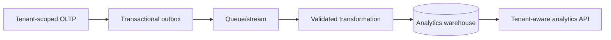

# Real Estate Agency CRM — Enterprise Evolution Specification

**Document version:** 1.0  
**Status:** Future-scope architecture baseline; not approved for MVP implementation  
**Last updated:** 2026-07-25  
**Audience:** Product strategy, architecture, engineering leadership, security, operations, and commercial teams

## 1. Purpose and Boundary

This document defines capabilities that may be added after the 0.1 MVP proves product fit and operational correctness. It is intentionally separate from `PROJECT_SPEC_MVP.md`.

Nothing in this document is an MVP requirement. Enterprise data fields, tables, packages, services, interfaces, feature flags, routes, or UI placeholders MUST NOT be added to the MVP merely to anticipate this roadmap.

An Enterprise capability enters implementation only after:

1. Product scope and acceptance criteria are approved.
2. Security, tenancy, privacy, and operational impact are reviewed.
3. An architecture decision record identifies the minimum change to the existing system.
4. Schema and API compatibility plans are approved.
5. The capability has an owner, success metric, rollout strategy, and rollback plan.

## 2. Evolution Principles

### 2.1 Additive by default

- Extend the MVP through additive migrations and versioned APIs.
- Do not repurpose a field with a different meaning.
- Preserve agency data isolation at every storage and processing boundary.
- Keep billing, identity, messaging, analytics, and integration domains separate from operational CRM data.
- Prefer modular monolith boundaries until independent scaling or ownership is demonstrated.

### 2.2 No speculative MVP scaffolding

Enterprise-only concepts remain absent from the MVP schema, including:

- Plan, subscription, invoice, payment, quota, and trial data
- Public sharing tokens and QR metadata
- AI scores, embeddings, provider IDs, or duplicate clusters
- Message campaigns, push tokens, and delivery logs
- Webhook subscriptions and public API clients
- 2FA secrets, trusted devices, and login history
- Marketplace installation records
- Storage-provider-specific domain fields
- Replica, shard, region, and failover metadata

### 2.3 Tenant isolation remains non-negotiable

Every Enterprise subsystem MUST carry a trustworthy tenant identity derived from authenticated server-side context. Events, queues, search documents, objects, metrics, exports, caches, and webhook deliveries MUST be tenant-scoped and tested for cross-tenant leakage.

### 2.4 Commercial and operational separation

An Agency's commercial account state controls access but does not become embedded throughout operational records. The subscription domain exposes a small entitlement service; operational modules consume decisions, not billing tables.

## 3. Capability Portfolio

| Track | Capability | Entry trigger | Primary risk |
|---|---|---|---|
| Growth | Self-service agency registration | Manual provisioning blocks acquisition | Fraud and tenant bootstrap |
| Monetization | Plans, subscriptions, billing, payment | Pricing and packaging validated | Financial correctness |
| Distribution | Property sharing, QR, temporary links | Agencies request external listing workflows | Privacy and revocation |
| Intelligence | AI, valuation, duplicate detection | Sufficient clean data and measured use case | Incorrect or biased output |
| Insight | Analytics | Operational reporting no longer answers decisions | Tenant leakage and cost |
| Engagement | Push, SMS, email | Transactional communication has clear value | Consent and deliverability |
| Platform | Redis, Queue, Horizon | Synchronous latency/reliability limits reached | Eventual consistency |
| Search | Elasticsearch | MySQL search fails measured relevance/latency needs | Index consistency |
| Media | S3 and CDN | Local media constrains deployment/scale | Object authorization |
| Operations | Backup and monitoring | Production commercial commitments begin | False confidence |
| Client | PWA and iOS | Validated demand and support capacity | Platform QA |
| Ecosystem | Public API and webhooks | Approved partner use cases exist | Abuse and versioning |
| Ecosystem | Marketplace | Reusable partner integrations mature | Supply-chain risk |
| Trust | Advanced audit, login/device history, 2FA | Regulated or larger customers require it | Sensitive security data |
| Scale | HA, scaling, disaster recovery | SLO and load justify redundancy | Complexity and data loss |

## 4. Self-Service Agency Registration

### 4.1 Scope

Future onboarding may provide:

- Public agency registration
- Email and phone verification
- Agency identity and domain checks
- Terms/privacy acceptance with version evidence
- First-manager account creation
- Trial or paid-plan selection
- Guided workspace setup
- Abuse prevention and manual review
- Onboarding progress and abandonment recovery

### 4.2 Candidate architecture

Use a dedicated onboarding application service and an explicit state machine:

```text
started
→ contact_verified
→ agency_profile_completed
→ commercial_terms_accepted
→ payment_pending | manual_review | provision_ready
→ provisioned
→ rejected | expired
```

Provisioning creates the Agency, agency settings, first manager, roles, and initial commercial account in one orchestrated workflow. Financial actions and tenant provisioning require idempotency keys.

### 4.3 Security requirements

- Rate-limit registration and verification.
- Use short-lived, one-time verification tokens stored as hashes.
- Detect disposable email and automated abuse according to approved policy.
- Do not activate a workspace until all required checks pass.
- Record consent version, timestamp, and source.
- Avoid exposing whether an agency already exists beyond the approved recovery flow.

## 5. Plans, Subscriptions, Billing, and Payments

### 5.1 Domain model

Candidate Enterprise entities:

- Commercial account
- Product and price
- Plan and entitlement
- Subscription and subscription item
- Trial
- Invoice and invoice line
- Payment attempt and refund
- Tax profile
- Provider customer/payment references
- Usage meter and quota snapshot

These entities are Enterprise migrations; none are added to the MVP.

### 5.2 Architectural rules

- Provider webhook payloads are verified, persisted, and processed idempotently.
- Internal subscription state is authoritative for access decisions; provider state is reconciled.
- Money uses currency-aware fixed-point values.
- Billing records are append-oriented and never silently rewritten.
- Entitlements are evaluated through one `EntitlementService`.
- Loss of the payment provider must not corrupt operational CRM data.
- Grace periods, failed payment, suspension, cancellation, refund, and reactivation are explicit states.
- Commercial suspension and security suspension are distinguishable.

### 5.3 Acceptance themes

- Duplicate webhook deliveries do not duplicate invoices or payments.
- Plan changes are effective at documented boundaries.
- Tenant access follows entitlement and grace-period rules.
- Currency, tax, refunds, and invoice numbering are legally reviewed for target markets.
- Financial reconciliation can explain every provider transaction.

## 6. Property Sharing, QR, and Temporary Links

### 6.1 Scope

Future sharing may provide:

- Public or recipient-limited property pages
- QR codes that resolve to a share
- Expiring links
- Password-protected or one-time links
- Per-share field visibility
- Revocation
- View count and last-view timestamp
- Agency branding

### 6.2 Security and privacy

- Share tokens use at least 128 bits of cryptographic entropy and are stored hashed where lookup design permits.
- Public identifiers never reveal internal Property IDs or agency sequence.
- Revocation takes effect immediately across caches/CDN.
- Deleted, archived, or no-longer-authorized Properties invalidate shares according to policy.
- Owner details, internal notes, history, assignment, and customer information are never public.
- QR codes contain only the public share URL.
- Rate limits, bot controls, and abuse reporting are required.

### 6.3 Candidate entities

- `property_shares`
- `property_share_views`
- `share_branding_profiles`

These are created only when the feature is approved.

## 7. AI, Valuation, and Duplicate Detection

### 7.1 Approved use-case requirement

No AI capability begins with a general "AI platform" project. Each capability must define:

- User decision being assisted
- Input data and lawful basis
- Measurable quality threshold
- Human review step
- Failure behavior
- Cost ceiling
- Data retention and provider policy

### 7.2 Candidate capabilities

- Suggested listing description
- Property price range recommendation
- Similar-property retrieval
- Owner, customer, or property duplicate candidates
- Lead-to-property matching
- Data-quality suggestions

### 7.3 Guardrails

- AI output is advisory and labeled as generated.
- Users confirm all writes; models do not autonomously mutate operational records.
- Sensitive identity data and secrets are excluded from prompts.
- Provider requests carry tenant and request correlation without leaking tenant data.
- Training on tenant content is opt-in and contractually controlled.
- Prompt/model version and confidence are recorded for consequential suggestions.
- Valuation shows evidence, data age, uncertainty, and geographic coverage.
- Duplicate detection proposes merges; a deterministic, reversible merge workflow performs them.
- Model fallback cannot silently change business rules.

### 7.4 Data architecture

Embeddings, feature vectors, model runs, and duplicate clusters belong to an isolated Intelligence module. They are not columns on MVP operational tables. Retention and deletion propagate from source records.

## 8. Analytics

### 8.1 Scope

Enterprise analytics may provide:

- Funnel and cohort analysis
- Agent activity and conversion analysis
- Listing lifecycle and time-to-close
- Inventory aging
- Geographic and pricing analysis
- Scheduled dashboards and exports
- Commercial product usage and retention metrics

### 8.2 Architecture evolution

Start with read replicas or dedicated aggregate tables only after measured need. A later stage may use:



Rules:

- Analytics is never run through unbounded queries on the primary OLTP database.
- Event schemas are versioned.
- Reprocessing is idempotent.
- Tenant filters are mandatory at warehouse and API layers.
- Product analytics and customer business analytics have separate consent and retention rules.
- Small cell suppression is applied where aggregate data could reveal individuals.

## 9. Push, SMS, and Email

### 9.1 Capability layers

1. Transactional notifications
2. User preferences and channel verification
3. Templates and localization
4. Delivery status and retry
5. Campaigns and scheduling

Campaigns are not assumed merely because transactional messaging exists.

### 9.2 Candidate entities

- Notification preferences
- Verified channels
- Device push tokens
- Message templates and versions
- Message intents
- Delivery attempts
- Provider callbacks
- Consent and suppression records

### 9.3 Rules

- All sending is asynchronous and idempotent.
- Consent, opt-out, quiet hours, and legal sender requirements are enforced per channel/region.
- Templates are versioned and rendered server-side from allowlisted variables.
- Provider callbacks are signature-verified.
- Tokens and phone/email values are protected and minimized in logs.
- Permanent failures suppress repeated attempts.
- Tenant sending limits and platform abuse controls are mandatory.

## 10. Redis, Queue, and Horizon

### 10.1 Entry criteria

Introduce these only when one or more measured needs exist:

- Request work exceeds acceptable latency.
- External providers require retry.
- Notifications or indexing require asynchronous processing.
- Distributed cache/locks are required across multiple application nodes.

### 10.2 Rules

- Redis uses separate namespaces or logical databases for cache, sessions, queues, and rate limiting where operationally appropriate.
- Queue payloads contain identifiers, not serialized sensitive model graphs.
- Every job carries `agency_id`, request/correlation ID, and schema version.
- Workers establish TenantContext from trusted job data and fail closed.
- Jobs are idempotent and define retry, backoff, timeout, and terminal-failure handling.
- Horizon access is Super Admin/operations-only and exposes no sensitive payloads.
- A transactional outbox is used when database commit and message publication must be atomic.
- Queue lag, failure rate, retry count, and poison messages are monitored.

## 11. Elasticsearch

### 11.1 Entry criteria

Elasticsearch is justified only by measured failure of MySQL search against:

- Search latency targets
- Relevance expectations
- Typo tolerance
- Persian/Arabic normalization
- Faceting volume
- Cross-field ranking

### 11.2 Index rules

- Every document contains `agency_id`.
- Every query contains an immutable server-injected agency filter.
- Index aliases support zero-downtime schema evolution.
- Indexing consumes versioned outbox events.
- Documents contain only fields required for search results.
- Deletion, tenant suspension, and privacy erasure propagate promptly.
- Search authorization is rechecked against OLTP before a sensitive mutation.
- Reindexing is resumable, observable, and tenant-aware.

Elasticsearch is a projection, never the source of truth.

## 12. S3-Compatible Storage and CDN

### 12.1 Migration path

Laravel Storage remains the application boundary. Enterprise implementation may:

1. Add an S3-compatible private disk.
2. Copy and checksum existing local objects.
3. Dual-read during migration.
4. Switch writes after verification.
5. Remove local objects after the retention window.

### 12.2 Rules

- Buckets/objects are private by default.
- Object keys are non-guessable and tenant-partitioned.
- Database metadata remains provider-neutral.
- Downloads use short-lived authorized URLs or an authenticated proxy.
- Uploads use validated content type, size, checksum, and optional malware scanning.
- CDN caches only explicitly public share assets.
- Revocation and deletion invalidate or expire cached objects.
- Lifecycle rules and orphan reconciliation are defined.

## 13. Backup, Monitoring, and Operational Readiness

### 13.1 Backup

Commercial production requires:

- Encrypted automated database backups
- Object-storage backups or versioning
- Defined retention by data class
- Off-site copy
- Backup completion alerts
- Regular restore drills
- Documented recovery time and recovery point objectives

A backup is considered valid only after a successful restore verification.

### 13.2 Observability

Required signals:

- Structured application logs
- Metrics for latency, throughput, error rate, saturation, queue lag, and database health
- Distributed traces when multiple services exist
- Synthetic login/core-workflow checks
- Security alerts
- Business-critical delivery/reconciliation alerts

Rules:

- All signals carry environment and correlation ID.
- Tenant IDs may be recorded as internal identifiers, but tenant payload data is excluded.
- Alert ownership, severity, escalation, and runbooks are documented.
- Health endpoints distinguish liveness, readiness, and dependency degradation.

## 14. PWA and iOS

### 14.1 PWA

A PWA may reuse versioned REST APIs but requires its own threat model:

- Browser token/session strategy
- CSRF/XSS controls
- Service-worker update behavior
- Cache partitioning and logout purge
- Offline-read/write scope
- Installability and browser support matrix

No service worker caches sensitive cross-user data without a reviewed partition and purge design.

### 14.2 iOS

iOS release requires:

- Supported-device and OS matrix
- Apple signing and release pipeline
- Keychain verification
- Permission usage descriptions
- Background behavior review
- Accessibility and RTL QA
- App Store privacy labels and review compliance
- Physical-device regression tests

Shared Flutter code does not make iOS automatically accepted.

## 15. Public API and Webhooks

### 15.1 Public API

Future public API requirements:

- OAuth 2.1 or scoped API credentials according to client type
- Per-client scopes and tenant binding
- Explicit API terms and data-processing rules
- Versioning and deprecation policy
- Per-client rate limits and quotas
- Idempotency for create/payment-sensitive operations
- Developer documentation and sandbox
- Credential rotation and revocation

Internal mobile tokens MUST NOT be reused as partner credentials.

### 15.2 Webhooks

- Tenants select approved event types and endpoints.
- Payloads contain stable public IDs, event ID, occurred time, and schema version.
- Deliveries are signed with rotatable secrets.
- Delivery is at least once; consumers use event IDs for deduplication.
- Retries use exponential backoff with a terminal state.
- Endpoint verification prevents SSRF and private-network targeting.
- Replay is controlled, logged, and tenant-authorized.
- Payloads are minimized and never include secrets or internal notes by default.

## 16. Marketplace

Marketplace scope may include:

- Curated integrations
- Installation and tenant authorization
- Scoped credentials
- Version compatibility
- Configuration and uninstall
- Billing/revenue sharing
- Partner review and incident response

Security requirements:

- Each integration declares scopes, outbound hosts, data use, and retention.
- Installation requires an Agency Manager with explicit consent.
- Secrets use managed encryption and rotation.
- Uninstall revokes access and defines retained data.
- Marketplace packages are signed/scanned and subject to review.
- A kill switch can disable a compromised integration without disabling CRM access.

The Marketplace begins only after the public integration platform is stable.

## 17. Advanced Audit, Login History, Device Management, and 2FA

### 17.1 Advanced audit

Enterprise audit may record:

- Actor and effective actor
- Tenant
- Action and target
- Before/after field-level changes
- Reason and source channel
- Request, IP, user agent, and device
- Timestamp and integrity evidence

Audit storage is append-only, access-controlled, retention-managed, and separated from normal domain history. Sensitive values are redacted or classified.

### 17.2 Login and device history

- Record successful and failed authentication events according to privacy policy.
- Provide session/token inventory and remote revocation.
- Identify devices using transparent user-visible labels, not invasive fingerprinting by default.
- Notify users of material security events after verified communication channels exist.

### 17.3 Two-factor authentication

Candidate methods:

- TOTP authenticator
- Recovery codes
- WebAuthn/passkeys in a later stage

Rules:

- Secrets and recovery codes are encrypted/hashed as appropriate.
- Recovery codes are single-use.
- Enrollment requires recent reauthentication.
- Reset is a high-risk workflow with enhanced verification and audit.
- Role/risk policy may require 2FA for Super Admin and Agency Manager.
- Mobile and web flows use one coherent authentication assurance model.

## 18. High Availability, Scaling, and Disaster Recovery

### 18.1 Scale stages

#### Stage A — Vertical single-region

- Larger application/database nodes
- Query/index optimization
- Object storage
- Redis and queue workers
- Automated backup and monitoring

#### Stage B — Redundant application tier

- Multiple stateless application nodes
- Shared Redis/session strategy
- Load balancer and health checks
- Managed database or primary/replica topology
- Centralized object storage and observability

#### Stage C — Data scale

- Read replicas for eligible workloads
- Dedicated analytics/search stores
- Tenant-aware archiving
- Evaluated partitioning or sharding

#### Stage D — Disaster recovery

- Secondary recovery environment/region
- Replicated backups and configuration
- Defined RTO/RPO
- Tested failover and failback

### 18.2 Rules

- Scale only from measured bottlenecks.
- Application nodes remain disposable and stateless.
- Writes use a clearly defined primary.
- Read-after-write consistency is explicit when replicas are used.
- Tenant sharding, if adopted, is hidden behind a tenant connection resolver and migration control plane.
- Cross-tenant aggregate operations must not require unsafe unbounded fan-out.
- Disaster recovery is exercised, not merely documented.
- Every topology change has capacity tests, failure-mode tests, observability, and rollback.

## 19. Enterprise Security and Compliance Workstream

Before commercial Enterprise commitments:

- Perform threat modeling for each new subsystem.
- Establish vulnerability management and dependency update SLAs.
- Run regular penetration tests.
- Define data classification and retention.
- Implement privacy access/export/deletion workflows as legally required.
- Document subprocessors and data residency.
- Formalize incident response, breach notification, and evidence preservation.
- Apply least privilege to infrastructure, databases, CI/CD, and support access.
- Manage secrets and encryption keys through a dedicated service.
- Review support impersonation separately; it is not implicitly authorized by Super Admin role.

Compliance labels or certifications must not be claimed until independently satisfied.

## 20. Suggested Enterprise Delivery Sequence

### Wave 1 — Production trust

- Automated backup and restore drills
- Monitoring, alerting, structured logs
- Object storage
- Redis/queues for proven asynchronous work
- Advanced security foundations

### Wave 2 — Commercialization

- Self-service onboarding
- Plans, subscriptions, invoices, payments
- Entitlements and commercial suspension
- Transactional email/SMS

### Wave 3 — Distribution and platform

- Property sharing and QR
- Public API and webhooks
- PWA/iOS according to demand
- Partner integrations

### Wave 4 — Insight and intelligence

- Search engine after relevance benchmark
- Analytics pipeline
- Duplicate assistance
- Valuation and AI-assisted workflows

### Wave 5 — Large-customer operations

- Advanced audit and device/session management
- Mandatory 2FA/passkeys by policy
- Marketplace governance
- HA, regional recovery, and evaluated tenant sharding

Wave order may change only with an explicit dependency and risk review.

## 21. Enterprise Feature Definition of Ready

A capability is ready for implementation only when:

1. Customer problem and measurable outcome are validated.
2. MVP behavior being extended is identified.
3. Data ownership, retention, and deletion are defined.
4. Tenant-isolation design covers database, cache, queue, storage, search, logs, and external providers.
5. API/schema compatibility and migration strategy are approved.
6. Security and abuse cases are documented.
7. Operational metrics, alerts, and runbooks are specified.
8. Cost model and capacity assumptions are reviewed.
9. Rollout, feature gating, rollback, and support ownership are defined.
10. No Enterprise placeholder is required in an earlier release.

## 22. Enterprise Feature Definition of Done

A capability is done only when:

- Product acceptance criteria and performance objectives pass.
- Data migration and rollback are rehearsed.
- Cross-tenant, authorization, abuse, and privacy tests pass.
- Failure, retry, idempotency, and reconciliation paths are tested.
- Dashboards, alerts, and runbooks are live.
- User documentation, contractual terms, and support procedures are updated.
- Security review findings are resolved or explicitly accepted.
- Gradual rollout completes without unresolved critical regressions.
