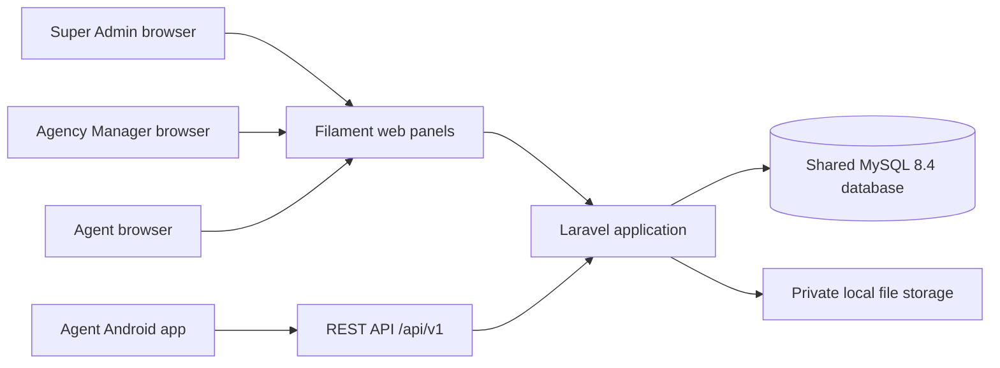

# Real Estate Agency CRM — MVP Product and Architecture Specification

**Document version:** 1.0  
**Product release:** 0.1 (MVP)  
**Status:** Implementation baseline  
**Last updated:** 2026-07-25  
**Audience:** Product owners, backend developers, Flutter developers, QA engineers, DevOps engineers, and technical reviewers

## 1. Purpose

This document is the executable product and architecture specification for the MVP of a multi-tenant CRM for real estate agencies. It defines what must be built, the rules that govern it, and the acceptance conditions for release 0.1.

This specification is normative:

- **MUST** and **MUST NOT** are release requirements.
- **SHOULD** indicates the default implementation unless a documented architecture decision approves an alternative.
- **MAY** indicates an optional implementation detail that must not expand the MVP scope.

`DATABASE_DESIGN.md` is authoritative for physical schema details. `CODING_STANDARDS.md` is authoritative for implementation conventions. `PROJECT_SPEC_ENTERPRISE.md` contains future capabilities and is not part of MVP acceptance.

## 2. Product Summary

The product is a CRM used by real estate agencies to manage:

- Agency users and agents
- Property owners
- Property inventory and images
- Customers and their requirements
- Property and customer notes
- Property change history
- Search, filtering, saved filters, dashboards, and operational reports

Each agency is an independent tenant. All tenants share one MySQL database and tenant-owned rows are isolated by `agency_id`.

The MVP is provisioned manually: a Super Admin creates an agency and its first Agency Manager. Public agency registration, subscriptions, billing, and payment are not part of this release.

## 3. Vision and Success Criteria

### 3.1 Vision

Provide a small number of real estate agencies with a secure, usable, Android-first operational CRM that can later evolve into a commercial SaaS platform without carrying speculative Enterprise features in the MVP.

### 3.2 MVP success criteria

The MVP is successful when:

1. A Super Admin can create and activate an agency and its first manager.
2. An Agency Manager can manage agents, owners, properties, customers, reports, and agency settings.
3. An Agent can use both a restricted web panel and the Android Flutter application for daily property and customer work.
4. No tenant can read, mutate, infer, or download another tenant's data.
5. Property codes remain unique and sequential per agency under concurrent requests.
6. Core workflows are covered by automated tests, including an IDOR test matrix.
7. A clean installation can be started locally through the documented development environment.
8. The application can later be deployed to a single VPS without redesigning application boundaries.

### 3.3 Non-goals

The MVP does not attempt to:

- Automate agency acquisition or onboarding.
- Implement subscriptions, billing, invoices, or payments.
- Publish or share property listings publicly.
- Provide AI, duplicate detection, valuation, or recommendations.
- Provide push, SMS, or email campaigns.
- Provide advanced analytics or a data warehouse.
- Operate at high availability or horizontal scale.
- Support Redis, queues, Horizon, Elasticsearch, S3, or a CDN.
- Provide PWA, iOS release, public API, webhooks, or a marketplace.
- Provide 2FA, device management, login history, impersonation, or advanced commercial audit logs.
- Support offline writes or conflict resolution in Flutter.

Future features are defined only in `PROJECT_SPEC_ENTERPRISE.md`.

## 4. Product Vocabulary

| Term | Definition |
|---|---|
| Agency | A tenant and the primary data-isolation boundary. |
| Super Admin | A platform operator who provisions agencies and agency managers. |
| Agency Manager | A tenant administrator who can access all operational data within one agency. |
| Agent | A tenant user with restricted access based on assignment and record policy. |
| Property | A sale or rental listing managed by an agency. |
| Owner | A person or company associated with one or more properties. |
| Customer | A buyer or renter lead managed by an agency and assigned to an agent. |
| Archived | A business state that hides a record from active workflows without deleting it. |
| Soft deleted | A recoverable trash state represented by `deleted_at`; it is distinct from archived. |
| Tenant context | The validated agency identity attached to an authenticated request. |

## 5. Technology Baseline

The implementation MUST pin exact patch versions in lock files. The supported release families are:

| Area | MVP baseline | Decision |
|---|---|---|
| Backend language | PHP 8.3 | Minimum supported by Laravel 13. |
| Backend framework | Laravel 13.x | Version constraint `^13.0`; lock file pins the installed patch. |
| Web administration | Filament 5.x, Livewire 4.x | Three separately configured Filament panels. |
| Database | MySQL 8.4 LTS, InnoDB, `utf8mb4` | Stable LTS line; one shared database. |
| Authorization | Laravel Policies + Spatie Laravel Permission 8.x | Roles/permissions are the only authorization source. |
| Mobile API auth | Laravel Sanctum | Personal access tokens for the Flutter app. |
| Web auth | Laravel session guard | Used only by Filament web panels. |
| Mobile | Flutter 3.44 stable / Dart 3.12 | Android-first release. |
| Flutter state | Riverpod | Feature-scoped state and dependency injection. |
| Flutter HTTP | Dio | Interceptors, timeouts, and normalized API errors. |
| Flutter routing | go_router | Declarative authenticated routing. |
| Mobile secret storage | flutter_secure_storage | Sanctum token storage. |
| Local development | Docker Compose + WSL2 | PHP, Nginx, and MySQL run in containers; Android tools run on the host. |
| Web assets | Vite + Tailwind as required by Filament | No separate SPA. |
| Tests | PHPUnit for Laravel; `flutter_test` for Flutter | Feature tests are the backend release gate. |

Normative version references:

- [Laravel 13 release notes](https://laravel.com/docs/13.x/releases)
- [Filament 5 upgrade requirements](https://filamentphp.com/docs/5.x/upgrade-guide)
- [Flutter SDK archive](https://docs.flutter.dev/install/archive)
- [MySQL 8.4 LTS release model](https://dev.mysql.com/doc/refman/8.4/en/mysql-releases.html)
- [Spatie Laravel Permission prerequisites](https://spatie.be/docs/laravel-permission/v8/prerequisites)

## 6. System Context



### 6.1 Runtime components

The MVP contains:

- One Laravel application.
- Three Filament panel providers in the same Laravel application.
- One versioned REST API in the same Laravel application.
- One MySQL schema shared by all agencies.
- One private local storage disk for property images.
- One Android Flutter application.

The MVP MUST NOT introduce microservices, a message broker, background workers, or a second operational datastore.

## 7. Backend Architecture

### 7.1 Request flow

The conceptual application flow is:

```text
Route
→ Authentication and tenant middleware
→ Controller or Filament action
→ Form Request / form validation
→ DTO
→ Application Service
→ Repository Contract
→ Eloquent Repository
→ Eloquent Model
→ API Resource or Filament view model
```

Authorization Policies apply before any protected record operation. A database transaction surrounds multi-record mutations and invariant checks.

### 7.2 Layer responsibilities

| Layer | Required responsibility | Prohibited responsibility |
|---|---|---|
| Route | Versioning, middleware, rate-limit group, controller binding | Business logic |
| Middleware | Authentication, request ID, tenant context, coarse access gate | Record-level authorization |
| Controller | Parse request, authorize, call one service operation, return resource | Queries, transactions, business rules |
| Form Request | Input validation and input-level authorization | Persistence |
| DTO | Immutable validated input | Querying or service lookup |
| Service | Use-case orchestration, business rules, transaction boundary | HTTP or Filament-specific formatting |
| Repository contract | Use-case-oriented persistence boundary | Generic catch-all CRUD API |
| Eloquent repository | Tenant-safe Eloquent queries and persistence | Authorization decisions |
| Model | Relations, casts, scopes, simple state helpers | Request access or workflow orchestration |
| Policy | Role, tenant, assignment, and record authorization | Data mutation |
| API Resource | Stable external JSON representation | Authorization or persistence |
| Observer | Simple lifecycle side effects only | Code generation, network calls, or complex workflows |
| Domain event | A real domain fact handled synchronously in MVP | A disguised queue contract |

### 7.3 Package boundaries

Backend code SHOULD be organized by application responsibility:

```text
app/
  Domain/{Agency,Property,Owner,Customer,User}/
  Application/{DTOs,Services,Contracts}/
  Infrastructure/Persistence/Eloquent/
  Http/{Controllers,Requests,Resources,Middleware}/Api/V1/
  Filament/{Control,Agency,Agent}/
  Policies/
  Support/Tenancy/
```

The exact namespace rules are defined in `CODING_STANDARDS.md`.

## 8. Architecture Decisions

### ADR-001 — Shared-database row tenancy

- All tenant-owned tables MUST contain a non-null `agency_id`.
- Tenant queries are limited by an automatic `AgencyScope`.
- The current agency is provided by a fail-closed `TenantContext`.
- Policies provide the second authorization boundary.
- Database constraints enforce same-agency relationships where practical.

### ADR-002 — Separate web and mobile authentication

- Filament panels use the Laravel `web` session guard and CSRF protection.
- Flutter uses Sanctum bearer tokens.
- A web session MUST NOT be accepted as mobile API authentication.
- A Sanctum token MUST NOT grant access to Filament panels.

### ADR-003 — One authorization source

- Spatie roles and permissions are the only role/permission source.
- The `users` table MUST NOT contain `role`, `roles`, `permission`, or `permissions` columns.
- Spatie's teams feature is disabled because an MVP user belongs to at most one agency; `users.agency_id` is the membership boundary.
- Direct per-user permissions are disabled in MVP.
- Policies combine permissions with tenant and assignment rules.

### ADR-004 — Private local image storage

- Laravel's Storage abstraction is used because the MVP itself needs storage.
- The configured MVP disk is private local storage.
- Images are downloaded through an authorized application route.
- S3, CDN, public links, and signed shares are not represented in the MVP schema.

### ADR-005 — Synchronous processing

- All MVP work completes in the request lifecycle.
- Events may update local history synchronously.
- Queue jobs, retry infrastructure, Horizon, and failed-job tables are excluded.

### ADR-006 — Android-first Flutter

- The release target is Android.
- Shared Flutter code SHOULD remain platform-neutral when this adds no cost.
- iOS packaging, signing, QA, and release acceptance belong to Enterprise.

## 9. Multi-Tenancy and Data Isolation

### 9.1 Tenant resolution

`TenantContext` MUST:

1. Read the authenticated user.
2. Reject inactive or soft-deleted users.
3. Reject users belonging to an inactive agency.
4. For Agency Manager and Agent requests, require a non-null `agency_id`.
5. Resolve exactly that agency and expose it for the current request only.
6. Throw a tenant-context exception when any requirement fails.

It MUST NOT infer a tenant from a route parameter, request body, header, hostname, or client-provided `agency_id`.

### 9.2 Fail-closed behavior

For tenant-scoped models:

- If tenant context is missing, normal queries MUST fail before SQL execution.
- The scope MUST never fall back to an unscoped query.
- API payloads MUST ignore or reject client-provided `agency_id`.
- Services set `agency_id` from `TenantContext`.

### 9.3 Explicit global access

Super Admin operations use dedicated platform repositories and explicit unscoped methods. Generic `withoutGlobalScope()` calls are forbidden outside those named methods.

The MVP Super Admin UI has no screen for browsing tenant properties, owners, customers, notes, or images. Platform dashboards may show aggregate counts grouped by agency without exposing record content.

### 9.4 Same-agency relationships

The database and service layer MUST prevent relationships across agencies:

- A Property and Owner link must carry one `agency_id` and satisfy composite foreign keys.
- Assigned agents must belong to the record's agency.
- Notes, images, history, and saved filters must match their parent/user agency.
- Route model binding must resolve records inside tenant scope.

### 9.5 Required isolation tests

Every tenant endpoint and Filament resource action MUST test:

- Same-tenant allowed access.
- Cross-tenant numeric/valid identifier access returns `404`.
- Cross-tenant update and delete have no side effects.
- Cross-tenant related IDs fail validation.
- Missing tenant context fails closed.
- Inactive agency and inactive user access are denied.

## 10. Authentication and Session Rules

### 10.1 Web authentication

- Each Filament panel has its own path and access callback.
- Login uses email and password through the `web` guard.
- Sessions rotate on login and privilege change.
- Logout invalidates the current session and regenerates the CSRF token.
- Session cookies are `HttpOnly`, `Secure` in non-local environments, and `SameSite=Lax`.
- Passwords are hashed with Laravel's configured Argon2id or bcrypt driver; plaintext passwords are never logged.

### 10.2 Mobile authentication

Endpoints:

| Method | Endpoint | Purpose |
|---|---|---|
| `POST` | `/api/v1/auth/login` | Exchange email, password, and device name for one Sanctum token. |
| `GET` | `/api/v1/auth/me` | Return the authenticated agent profile and permissions. |
| `POST` | `/api/v1/auth/logout` | Revoke the current token. |
| `POST` | `/api/v1/auth/logout-all` | Revoke all tokens owned by the current user. |

Rules:

- Only active users with the Agent role and an active agency can obtain an MVP mobile token.
- The login response returns the token exactly once.
- Flutter stores the token only in secure storage.
- Tokens have the `mobile` ability and expire after the configured MVP lifetime of 30 days.
- A successful login revokes expired tokens for that user.
- Password change, deactivation, agency suspension, or role removal revokes all user tokens.
- If `must_change_password` is true, login returns that flag with the token, and middleware permits only `/auth/me`, `/auth/logout`, and `/profile/password` until the password is changed.
- A successful forced password change clears the flag, revokes every existing token, and returns one replacement `mobile` token. The old current token becomes invalid.
- There is no refresh-token endpoint. Expiry requires login again.

### 10.3 Login throttling

- Mobile and web login: maximum 5 failed attempts per minute per normalized email and IP pair.
- Authenticated API: default 60 requests per minute per user; image upload and search have separate limits.
- Authentication responses MUST not reveal whether an email exists.

## 11. Roles and Permissions

### 11.1 Fixed roles

The seeded roles are:

- `super-admin`
- `agency-manager`
- `agent`

Role names are code-owned and cannot be created, renamed, or deleted through MVP UI.

### 11.2 Permission catalog

Permissions use `resource.action` names:

```text
platform.dashboard.view
agencies.view
agencies.create
agencies.update
agencies.activate
agency.dashboard.view
agency.settings.view
agency.settings.update
users.view
users.create
users.update
users.deactivate
users.reset_password
owners.view
owners.create
owners.update
owners.delete
owners.restore
properties.view
properties.create
properties.update
properties.delete
properties.restore
properties.assign
properties.change_status
properties.manage_images
properties.manage_notes
customers.view
customers.create
customers.update
customers.delete
customers.restore
customers.assign
customers.manage_notes
saved_filters.manage
reports.agency.view
reports.own.view
profile.update
```

### 11.3 Capability matrix

| Capability | Super Admin | Agency Manager | Agent |
|---|---:|---:|---:|
| Platform dashboard | Yes | No | No |
| Provision and activate agencies | Yes | No | No |
| Manage first Agency Manager | Yes | No | No |
| Agency dashboard | No | All agency | Own/assigned summary |
| Agency settings | No | View/update | No |
| Agent users | No | Manage | No |
| Owners | No | Full tenant CRUD/restore | View accessible; create; limited update |
| Properties | No | Full tenant CRUD/restore/assign | View tenant inventory; create; update assigned |
| Property status | No | All valid transitions | Valid transitions on assigned records, with restrictions |
| Property images/notes | No | Manage all tenant records | Manage on assigned properties |
| Customers | No | Full tenant CRUD/restore/assign | CRUD only for assigned customers; no delete/restore/reassign |
| Saved filters | No | Own filters | Own filters |
| Reports | Aggregate platform counts only | Agency report | Own report |
| Profile/password | Own | Own | Own |

### 11.4 Exact role-to-permission assignments

`super-admin`:

```text
platform.dashboard.view
agencies.view
agencies.create
agencies.update
agencies.activate
users.view
users.create
users.update
users.deactivate
users.reset_password
profile.update
```

Super Admin Policies restrict `users.*` operations to Agency Manager accounts selected through the Control panel.

`agency-manager`:

```text
agency.dashboard.view
agency.settings.view
agency.settings.update
users.view
users.create
users.update
users.deactivate
users.reset_password
owners.view
owners.create
owners.update
owners.delete
owners.restore
properties.view
properties.create
properties.update
properties.delete
properties.restore
properties.assign
properties.change_status
properties.manage_images
properties.manage_notes
customers.view
customers.create
customers.update
customers.delete
customers.restore
customers.assign
customers.manage_notes
saved_filters.manage
reports.agency.view
reports.own.view
profile.update
```

`agent`:

```text
agency.dashboard.view
owners.view
owners.create
owners.update
properties.view
properties.create
properties.update
properties.change_status
properties.manage_images
properties.manage_notes
customers.view
customers.create
customers.update
customers.manage_notes
saved_filters.manage
reports.own.view
profile.update
```

The permission seeder synchronizes these exact sets. Permissions not listed for a role are revoked during deterministic seeding. Record Policies further restrict tenant, assignment, state, note ownership, and target-role behavior.

### 11.5 Record-level Agent rules

An Agent:

- May view all non-deleted properties in their agency so that agency inventory is usable.
- May create a property; `assigned_agent_id` is set to the current Agent.
- May edit a property only when assigned to it.
- May not change property code, agency, assigned agent, or owner ownership shares after creation.
- May transition an assigned property between `available` and `reserved`.
- May request `sold` for sale listings or `rented` for rental listings only when required closing fields are valid; the change is recorded in history.
- May not archive, restore, soft delete, or unarchive a property.
- May view an Owner only through an accessible property or owner lookup during property creation.
- May create an Owner and link it to the property being created.
- May update an Owner only when the Agent is assigned to at least one active property linked to that Owner; identity fields and company/person type remain manager-only.
- May view, create, and update only Customers assigned to that Agent.
- May not reassign, delete, or restore Customers.
- May create notes on accessible records and edit/delete only their own notes.

Policies MUST implement these rules; UI visibility alone is not authorization.

## 12. Filament Web Panels

### 12.1 Control panel — `/control`

Allowed role: `super-admin`.

| Menu | Pages | Required operations |
|---|---|---|
| Dashboard | Platform overview | Active/suspended agency counts, manager counts, property/customer aggregate counts by agency; no tenant record content. |
| Agencies | List, create, view, edit | Search, filter active status, create, update contact data, activate/suspend. |
| Agency Managers | List, create, view, edit | Create the first manager, reset password, activate/deactivate, show owning agency. |
| Profile | View/edit profile, change password | Current user only. |

Agency suspension immediately blocks all agency web sessions on their next request and all mobile API calls. Existing mobile tokens are revoked as part of suspension.

### 12.2 Agency panel — `/agency`

Allowed role: `agency-manager`.

| Menu | Pages | Required operations |
|---|---|---|
| Dashboard | Agency dashboard | Inventory counts, customer counts, recent activity, workload by Agent. |
| Properties | List, create, view, edit, trash | Filters, sort, images, owners, notes, history, assignment, status transitions, archive, soft delete, restore. |
| Owners | List, create, view, edit, trash | Linked properties, contact search, soft delete/restore with dependency rules. |
| Customers | List, create, view, edit, trash | Requirements, assignment, notes, soft delete/restore. |
| Agents | List, create, view, edit | Activate/deactivate, password reset, workload summary. |
| Saved Filters | List/manage | Rename, set default, delete current manager's filters. |
| Reports | Operational report | Date range, property status, customer pipeline, Agent workload. |
| Agency Settings | General, property numbering | Contact defaults, locale, timezone, code prefix subject to lock rule. |
| Profile | View/edit profile, change password | Current user only. |

### 12.3 Agent panel — `/agent`

Allowed role: `agent`.

| Menu | Pages | Required operations |
|---|---|---|
| Dashboard | Personal dashboard | Assigned properties, assigned customers, recent notes, personal status counts. |
| Properties | List, create, view, edit assigned | Inventory search, owner selection/creation, images, notes, allowed status transitions. |
| Customers | List, create, view, edit assigned | Customer requirements and notes. |
| Saved Filters | List/manage | Current Agent only. |
| My Report | Personal report | Assigned inventory and customer activity. |
| Profile | View/edit profile, change password | Current user only. |

The Agent panel MUST apply the same Services and Policies as the API. Filament actions MUST NOT duplicate domain rules.

## 13. Operational Module Specifications

### 13.1 Agencies

Required fields:

- Display name
- Unique slug
- Contact email and phone
- Address, city, province, country code
- Timezone, locale, and three-letter currency code
- Active status

Rules:

- Only Super Admin can create or activate/suspend an agency.
- Creation also creates the one-to-one agency settings row in the same transaction.
- The first manager may be created in the same workflow or immediately afterward.
- An agency cannot be activated without at least one active Agency Manager.
- Slugs are globally unique, lowercase, and immutable after activation.
- Suspending an agency does not delete data.
- Agency deletion is not available in MVP.

Acceptance:

- A suspended agency receives `403 AGENCY_INACTIVE` for authenticated API requests.
- Its users cannot enter Agency or Agent panels.
- Other agencies remain unaffected.

### 13.2 Users and Agents

Rules:

- Email is normalized to lowercase and globally unique.
- Agency Manager and Agent users must have exactly one non-null agency.
- Super Admin users must have no agency.
- An Agency Manager can create only Agent users in their own agency.
- Super Admin can create Agency Manager users for an explicitly selected agency.
- Users are deactivated instead of hard-deleted.
- A deactivated Agent remains referenced in history and may be replaced on assigned records.
- An Agent with assigned active customers/properties may be deactivated only after confirmation; records remain assigned and are highlighted for reassignment.
- Password reset by an administrator sets a temporary password and requires change at next web login. Mobile tokens are revoked.

Acceptance:

- Changing a user's role or agency through request payload is impossible.
- Cross-agency user identifiers are never returned from tenant endpoints.
- Deactivation blocks the next request and revokes all mobile tokens.

### 13.3 Owners

Owner types:

- `person`
- `company`

Rules:

- A person requires `first_name` and `last_name`.
- A company requires `company_name`.
- Contact fields are optional individually, but at least one of mobile, phone, or email is required.
- Phone values are normalized before storage.
- Optional identity numbers are encrypted by an application cast and are not searchable.
- An Owner may be linked to multiple Properties, and a Property may have multiple Owners.
- A property-owner link may include an ownership percentage and a primary-owner flag.
- If percentages are provided for every linked Owner, their sum must be exactly `100.00`.
- Exactly one linked Owner MUST be primary.
- An Owner linked to a non-deleted Property cannot be soft-deleted until links are removed or the dependent properties are deleted.
- Restoring an Owner requires the agency to be active.
- Agent owner search requires a query of at least two characters, returns at most 20 summary matches, and omits identity number and full address.
- An Agent may open full Owner detail only when linked to an accessible Property; a manager may open any non-deleted Owner in the agency.

### 13.4 Properties

#### Types and states

`property_type`:

```text
apartment, house, villa, land, office, commercial, warehouse, other
```

`transaction_type`:

```text
sale, rent
```

`status`:

```text
available, reserved, sold, rented, archived
```

#### Required data

Every Property requires:

- Agency-generated immutable code
- Title
- Property type
- Transaction type
- Status
- At least one linked Owner
- City and street address
- Assigned Agent, unless created by a manager and intentionally left unassigned
- Currency code inherited from agency at creation

#### Conditional commercial rules

- Sale listings require `sale_price > 0`.
- Rental listings require `monthly_rent > 0`; `deposit_amount` may be zero or positive.
- Sale listings must have rental monetary fields null.
- Rental listings must have `sale_price` null.
- `sold` is valid only for a sale listing.
- `rented` is valid only for a rental listing.
- `closed_at` is required for `sold` and `rented`, and null otherwise.
- `archived_at` is required only for `archived`.
- Monetary values use fixed-point decimal fields, never floating point.
- Area, bedroom, bathroom, floor, build-year, and parking values must be internally plausible; `area_sqm > 0`, a non-basement floor cannot exceed `total_floors`, and `year_built` must be between 1800 and the next calendar year.
- Latitude and longitude are either both absent or both valid.
- Agency, code, and currency are immutable after creation.
- Only a manager may change `transaction_type` after creation, and only while the Property is `available`; the new commercial fields must validate in the same transaction.
- A `sold`, `rented`, or `archived` Property is read-only except for notes/history viewing until a manager performs an allowed state transition.

#### Property code generation

Format:

```text
{AGENCY_PREFIX}-{SEQUENCE_PADDED_TO_6}
```

Example: `ARY-000143`.

Generation MUST:

1. Start a database transaction.
2. Lock the agency settings row with `SELECT ... FOR UPDATE`.
3. Read and increment `next_property_sequence`.
4. Build the code from the locked prefix and sequence.
5. Insert the Property.
6. Commit.

The database enforces `UNIQUE (agency_id, code)`. Deadlock or duplicate-key conflicts are retried at most three times. An Observer MUST NOT generate property codes.

The property-code prefix is uppercase ASCII, 2–8 characters. A manager may change it only before the first Property exists.

#### Status transitions

| From | To | Agent | Agency Manager | Conditions |
|---|---|---:|---:|---|
| `available` | `reserved` | Assigned only | Yes | Optional reason. |
| `reserved` | `available` | Assigned only | Yes | Reason required. |
| `available` or `reserved` | `sold` | Assigned only | Yes | Sale listing; closing data valid. |
| `available` or `reserved` | `rented` | Assigned only | Yes | Rental listing; closing data valid. |
| Any non-archived | `archived` | No | Yes | Reason required. |
| `archived` | `available` | No | Yes | Commercial fields revalidated. |
| `sold` or `rented` | `available` | No | Yes | Correction reason required; `closed_at` cleared. |

Each transition creates an immutable Property History record in the same transaction.

#### Images

- Allowed MIME types: JPEG, PNG, WebP.
- Maximum file size: 10 MiB per image.
- Maximum count: 20 non-deleted images per Property.
- Filenames are generated; user filenames are stored only as metadata.
- Files are stored on a private local disk outside the public web root.
- Image dimensions are validated after decoding; claimed MIME type is not trusted.
- One image may be the cover. Cover selection is transactionally exclusive.
- Sort order is unique within a Property.
- Agents manage images only on assigned Properties.
- Deleting an image soft-deletes its database row and removes it from normal retrieval. Physical purge is not an MVP user operation.

#### Notes and history

- Property notes are internal tenant data.
- Managers may edit/delete any note; Agents may edit/delete their own notes.
- A note edit updates timestamps; note content changes are not an advanced audit trail.
- Property History records creation, material updates, status changes, archive, delete, and restore.
- History stores changed field names and old/new scalar values. It MUST exclude passwords, tokens, encrypted identity data, and image binary content.
- History is immutable and cannot be deleted through UI/API.

#### Archive versus delete

- `archived` is a searchable business state.
- Soft delete moves the record to manager-only Trash and excludes it from all normal/API searches.
- Agents cannot delete or restore.
- Restore is manager-only and revalidates linked owners and assigned Agent.
- Hard delete is not exposed in MVP.

### 13.5 Customers

Customer intent:

```text
buy, rent
```

Customer status:

```text
active, inactive, converted, lost
```

Rules:

- First name, last name, primary mobile, intent, status, and assigned Agent are required.
- Mobile is normalized; potential duplicates are allowed because household/shared numbers exist. No automated duplicate detection is performed.
- `budget_min` and `budget_max` must be non-negative and `budget_min <= budget_max`.
- Desired area bounds follow the same ordering rule.
- Preferred property types are a validated JSON array containing only known Property types.
- An Agent-created Customer is assigned to that Agent.
- Only a manager can reassign a Customer.
- Agents may read and mutate only assigned Customers.
- Conversion requires a linked Property from the same agency; the Property must be accessible and in a compatible transaction type.
- Allowed status transitions are `active → inactive|lost|converted`, `inactive → active|lost`, and `lost → active`.
- Reopening `converted → active` is manager-only and clears `converted_property_id` in the same transaction.
- An Agent may perform allowed transitions on an assigned Customer except reopening a converted Customer.
- Customer delete/restore is manager-only.
- Customer notes follow the same ownership rules as Property notes.

### 13.6 Saved Filters

Rules:

- Saved Filters belong to one user, one agency, and one module: `properties`, `owners`, or `customers`.
- A filter stores only a server-validated JSON filter object and sort selection.
- Raw SQL, arbitrary column names, executable expressions, and full request URLs are forbidden.
- Names are unique per user and module.
- A user may have at most 50 filters per module.
- At most one default filter exists per user/module; setting a new default clears the previous default in one transaction.
- Users can access only their own filters.
- If a future deployment removes a filter field, loading an old Saved Filter ignores the unknown key and returns a warning in response metadata.

### 13.7 Dashboard

Agency Manager dashboard:

- Property counts by status.
- Customer counts by status and intent.
- Unassigned properties.
- Agent workload: active assigned properties and customers.
- Ten most recent Property History items.

Agent dashboard:

- Assigned Property counts by status.
- Assigned active Customer count.
- Recently updated assigned Properties.
- Recent notes on accessible records.

Super Admin dashboard:

- Active/suspended agency counts.
- Active manager/agent counts.
- Aggregate Property and Customer counts grouped by agency.
- No owner/customer contact details or property addresses.

Dashboard queries are computed on demand and cached only by the default file cache for at most 60 seconds. Cache keys MUST contain role, user ID where relevant, and agency ID.

### 13.8 Reports

Agency report:

- Property count grouped by status, property type, transaction type, and assigned Agent.
- New/closed Property counts over a date range.
- Customer count grouped by status, intent, and assigned Agent.
- Agent workload summary.

Agent report:

- Current assigned inventory.
- Own Property status changes over a date range.
- Own Customer creation and status counts.

Rules:

- Date ranges are inclusive, interpreted in agency timezone, and limited to 366 days.
- Reports are read-only and generated synchronously.
- No scheduled reports, exports, charts requiring a warehouse, or predictive analytics.
- MVP output is an on-screen table and summary cards. CSV/PDF export is not required.

## 14. Search, Filtering, Sorting, and Pagination

### 14.1 Search behavior

Search is MySQL-backed and policy-scoped.

- Exact/prefix matching is used for Property code, normalized phone, and email.
- Case-insensitive contains matching is used for names, title, city, district, and address.
- Search terms are trimmed and limited to 100 characters.
- Global search requires at least 2 characters, returns at most 20 results per entity type, and never bypasses Policies.
- Search responses contain only summary fields needed to choose a record.

Elasticsearch, fuzzy ranking, phonetic search, and AI matching are excluded.

### 14.2 Property filters

Allowed filters:

- Status
- Property type
- Transaction type
- City and district
- Assigned Agent (manager only)
- Minimum/maximum sale price, rent, deposit, and area
- Minimum bedrooms
- Has images / no images
- Created/updated date range

Allowed sorts:

```text
created_at, updated_at, code, title, sale_price, monthly_rent, area_sqm, status
```

### 14.3 Customer filters

Allowed filters:

- Status
- Intent
- Assigned Agent (manager only)
- Preferred property type
- Budget range
- City/district requirement
- Created/updated date range

Allowed sorts:

```text
created_at, updated_at, last_name, budget_max, status
```

### 14.4 Pagination contract

- Default page size: 25.
- Allowed `per_page`: 10, 25, 50, or 100.
- Maximum: 100.
- Invalid sort/filter fields produce `422 INVALID_FILTER`.
- Stable secondary sort by `id` is always applied.
- Deleted rows are excluded unless the manager uses the explicit Trash screen; Trash is not exposed to Agents or mobile API.

## 15. REST API Specification

### 15.1 General contract

- Base path: `/api/v1`.
- Media type: `application/json`.
- Character encoding: UTF-8.
- Dates/times: ISO 8601 UTC with `Z`.
- Monetary values: JSON strings with two decimal places.
- IDs: JSON integers while values remain within the client-safe range; Flutter models use 64-bit integers.
- Request body field names: `snake_case`.
- Unknown request fields are rejected for mutation endpoints.
- Every response includes `X-Request-Id`.

### 15.2 Success envelopes

Single resource:

```json
{
  "data": {
    "id": 143,
    "code": "ARY-000143"
  },
  "meta": {
    "request_id": "01J..."
  }
}
```

Collection:

```json
{
  "data": [],
  "meta": {
    "pagination": {
      "current_page": 1,
      "per_page": 25,
      "last_page": 1,
      "total": 0,
      "from": null,
      "to": null
    },
    "request_id": "01J..."
  },
  "links": {
    "first": "...",
    "last": "...",
    "prev": null,
    "next": null
  }
}
```

Delete success returns `204 No Content`.

### 15.3 Error envelope

```json
{
  "error": {
    "code": "VALIDATION_FAILED",
    "message": "The submitted data is invalid.",
    "details": {
      "title": [
        "The title field is required."
      ]
    },
    "request_id": "01J..."
  }
}
```

| HTTP | Stable code | Meaning |
|---:|---|---|
| 400 | `BAD_REQUEST` | Malformed JSON or invalid protocol input. |
| 401 | `UNAUTHENTICATED` | Missing, expired, or revoked token. |
| 403 | `FORBIDDEN` | Authenticated but action is not allowed. |
| 403 | `AGENCY_INACTIVE` | Tenant is suspended. |
| 403 | `PASSWORD_CHANGE_REQUIRED` | Only the forced password-change flow is permitted. |
| 404 | `RESOURCE_NOT_FOUND` | Missing or inaccessible tenant resource; used for IDOR resistance. |
| 409 | `DOMAIN_CONFLICT` | Valid input conflicts with current domain state. |
| 409 | `STALE_RECORD` | Optimistic update timestamp no longer matches. |
| 413 | `FILE_TOO_LARGE` | Upload exceeds limits. |
| 415 | `UNSUPPORTED_MEDIA_TYPE` | Image type is not accepted. |
| 422 | `VALIDATION_FAILED` | Field validation failure. |
| 422 | `INVALID_FILTER` | Unsupported filter or sort. |
| 429 | `RATE_LIMITED` | Throttle exceeded. |
| 500 | `INTERNAL_ERROR` | Unexpected error; no internal detail is exposed. |

### 15.4 Resource endpoints

All endpoints require `auth:sanctum`, the `mobile` token ability, active-user middleware, tenant middleware, and Policies.

Properties:

```text
GET    /properties
POST   /properties
GET    /properties/{property}
PATCH  /properties/{property}
POST   /properties/{property}/status
GET    /properties/{property}/history
GET    /properties/{property}/notes
POST   /properties/{property}/notes
PATCH  /properties/{property}/notes/{note}
DELETE /properties/{property}/notes/{note}
GET    /properties/{property}/images
POST   /properties/{property}/images
PATCH  /properties/{property}/images/{image}
DELETE /properties/{property}/images/{image}
GET    /properties/{property}/images/{image}/content
```

Owners:

```text
GET    /owners
POST   /owners
GET    /owners/{owner}
PATCH  /owners/{owner}
```

Customers:

```text
GET    /customers
POST   /customers
GET    /customers/{customer}
PATCH  /customers/{customer}
GET    /customers/{customer}/notes
POST   /customers/{customer}/notes
PATCH  /customers/{customer}/notes/{note}
DELETE /customers/{customer}/notes/{note}
```

Saved filters and summaries:

```text
GET    /saved-filters
POST   /saved-filters
PATCH  /saved-filters/{savedFilter}
DELETE /saved-filters/{savedFilter}
GET    /dashboard
GET    /reports/me
GET    /search
PATCH  /profile
PUT    /profile/password
```

Mobile API intentionally omits agency settings, user administration, delete/restore, and reassignment.

### 15.5 Concurrency

Mutable resources expose `updated_at`. PATCH requests MUST include:

```json
{
  "expected_updated_at": "2026-07-25T10:20:30Z"
}
```

If the persisted timestamp differs, the API returns `409 STALE_RECORD` with the current resource summary. Status changes and cover-image changes always use transactions and row locks.

### 15.6 API compatibility

- Fields may be added in a backward-compatible minor release.
- Existing field meaning and type cannot change inside `/v1`.
- Removing or renaming a field requires `/v2`.
- Clients MUST ignore unknown response fields.
- Error `code` values are stable; human-readable messages may be localized later.

## 16. Flutter Application Specification

### 16.1 Application structure

```text
lib/
  app/
  core/
    auth/
    errors/
    network/
    routing/
    storage/
    theme/
  features/
    dashboard/
    properties/
    owners/
    customers/
    saved_filters/
    reports/
    profile/
```

Each feature contains `data`, `domain`, and `presentation` folders only when each layer has real responsibility. Empty ceremonial layers are forbidden.

### 16.2 Required screens

1. Splash/session restoration
2. Login
3. Required password change
4. Personal dashboard
5. Property list, search, filters, and saved filters
6. Property detail
7. Property create/edit
8. Owner lookup/create within Property workflow
9. Property image manager
10. Property notes and history
11. Customer list, search, filters, and saved filters
12. Customer detail/create/edit
13. Customer notes
14. My Report
15. Profile, password change, and logout

### 16.3 Mobile behavior

- The app is online-first.
- Read responses MAY be cached in memory for the active session.
- No offline mutation queue, local business database, or conflict merge is allowed.
- Network, authentication, validation, authorization, conflict, and server failures have distinct UI states.
- Lists use server pagination and preserve active filters during navigation.
- Pull-to-refresh reloads from page one.
- A `401` clears secure credentials and routes to login.
- A `403 AGENCY_INACTIVE` shows a blocking suspended-agency screen.
- A `403 PASSWORD_CHANGE_REQUIRED` routes to the required password-change screen without exposing other feature screens.
- A `409 STALE_RECORD` prompts the Agent to reload before editing.
- Upload progress and retry are displayed per image; a retry creates a new request.
- Sensitive API payloads and tokens are never printed in production logs.

### 16.4 Mobile acceptance

- The release builds and runs on the documented minimum Android SDK.
- Login state survives application restart until token expiry/revocation.
- All required screens handle loading, empty, success, and error states.
- Text scaling to 200% does not hide essential controls.
- Tap targets, contrast, labels, and keyboard focus pass the project accessibility checklist.
- Repository and provider tests cover error mapping, pagination, and auth expiry.
- Widget tests cover the primary Property and Customer paths.

## 17. Security Requirements

### 17.1 Mandatory controls

- Validate every external input.
- Authorize every record operation with a Policy.
- Use parameterized Eloquent/query-builder operations; raw concatenated SQL is forbidden.
- Escape output by default in Blade/Filament.
- Enforce CSRF protection for web mutations.
- Use TLS in every non-local environment.
- Store secrets only in environment/secret configuration, never in source control.
- Prevent mass assignment of `agency_id`, roles, permission IDs, ownership fields, and generated codes.
- Do not expose stack traces, SQL, paths, tokens, or encrypted values in API responses.
- Sanitize uploaded filenames and verify decoded image content.
- Serve images only after tenant and record authorization.
- Add security headers at Nginx/application level.
- Maintain dependency lock files and run dependency vulnerability checks in CI.

### 17.2 IDOR response policy

When a tenant-owned record does not exist inside the current tenant scope, the response is `404 RESOURCE_NOT_FOUND`, regardless of whether the identifier exists in another tenant. Timing and error body SHOULD be indistinguishable.

### 17.3 Logging

Baseline application logging records:

- Request ID
- Environment
- Route name and HTTP method
- Authenticated user ID and agency ID when available
- Stable event/error code
- Duration and response status

Logs MUST NOT contain:

- Passwords or password-reset values
- Sanctum tokens, session IDs, cookies, or Authorization headers
- Full owner/customer identity numbers
- Uploaded file bytes
- Entire request payloads

Property History is operational domain history, not an Enterprise audit log.

## 18. Development Environment

### 18.1 Required host tools

- Windows with virtualization enabled
- WSL2 and Ubuntu
- Docker Desktop with WSL integration
- Git inside WSL
- VS Code with WSL support
- Flutter SDK and compatible Java
- Android Studio, Android SDK, and emulator or physical Android device
- API client such as Bruno or Postman

### 18.2 Docker Compose services

Development Compose contains:

- `nginx`
- `app` (PHP-FPM, Composer, Laravel CLI)
- `mysql` (MySQL 8.4 LTS)

Source code is bind-mounted. MySQL data and private uploads use named development volumes. Docker Compose is a development tool, not the production orchestration specification.

### 18.3 Environment rules

- `.env.example` documents every required variable with safe placeholders.
- `.env` is ignored.
- Test environment uses a separate database.
- Seed credentials are deterministic only in local/test environments.
- Time is stored in UTC; display uses agency timezone.
- PHP, MySQL, and Flutter versions are pinned in project configuration and CI.

## 19. Future Single-VPS Deployment Readiness

The MVP architecture must remain deployable to one Linux VPS using:

- Nginx
- PHP-FPM
- Laravel application releases with a shared `storage` path
- MySQL 8.4
- HTTPS certificates
- Cron entry for Laravel Scheduler
- Private local upload directory

Deployment readiness requires:

- Environment-specific configuration.
- `config`, route, event, and view caching where compatible.
- Atomic release symlink or equivalent rollback-safe deployment.
- Migration pre-check and maintenance-mode procedure.
- Writable directory permissions limited to required paths.
- Health endpoint that checks application boot and database connectivity without exposing secrets.
- External/manual backup before schema migration as an operational safety step.

Automated backup platforms, monitoring stacks, HA, replicas, object storage, and disaster recovery automation remain Enterprise scope.

## 20. Non-Functional Requirements

### 20.1 Performance targets

Measured on the reference single-VPS-sized environment with seeded MVP data:

- P95 JSON read endpoint: under 500 ms, excluding client network latency.
- P95 JSON mutation endpoint without image upload: under 800 ms.
- P95 initial filtered list in Filament: under 1 second.
- Dashboard: under 2 seconds uncached.
- Standard list queries: no more than 10 SQL statements after authentication/tenant resolution.
- API list response: maximum 100 records.
- Image upload: request limit and PHP/Nginx limits support one 10 MiB image plus overhead.

These are release targets, not high-scale SLAs.

### 20.2 Reliability

- Multi-row domain mutations are transactional.
- Concurrent Property code creation cannot produce duplicates or sequence reuse after commit.
- Referential integrity is enforced with foreign keys and application invariants.
- Failed mutations leave no partial relationship or history rows.
- File/database consistency failures are logged with request ID and surfaced as a recoverable domain error.

### 20.3 Accessibility and localization readiness

- MVP interface language MAY be English or Persian according to product decision, but all source keys use English.
- All text visible to users comes from translation resources.
- Layout supports RTL without hard-coded left/right behavior.
- Dates and numbers use locale-aware presentation while API/storage remain canonical.
- Agency timezone is applied at the presentation boundary.

## 21. Test Strategy

### 21.1 Backend test layers

Unit tests:

- DTO construction
- Enum/state transition rules
- Money/phone normalization
- Property code formatting
- Policy decision helpers

Feature tests:

- Every API endpoint success and failure contract
- Each Filament resource action at Service/Policy boundary
- Validation and error envelopes
- Role matrix
- Tenant isolation and IDOR matrix
- Inactive user/agency
- Soft delete, archive, and restore
- Image authorization and validation
- Search/filter/sort allowlists
- Pagination shape

Integration/concurrency tests:

- Composite tenant relationships
- Concurrent Property code generation
- Status/history transaction atomicity
- Cover-image exclusivity
- Saved Filter default exclusivity
- Session/Sanctum separation

### 21.2 Flutter tests

- DTO and JSON serialization
- API error-to-domain mapping
- Auth token lifecycle
- Repository pagination and filter encoding
- Riverpod provider state transitions
- Widget tests for login, Property list/detail/edit, Customer list/detail/edit
- Navigation tests for expired auth and suspended agency

### 21.3 Release gate

Release requires:

- All automated tests pass.
- No skipped tenant-isolation tests.
- Database migrations pass on an empty database and a seeded previous MVP snapshot.
- Static analysis and format checks pass.
- Dependency audit has no unaccepted critical/high vulnerability.
- Manual smoke test passes for all three web panels and Android build.
- No unresolved severity-1 or severity-2 defects.

## 22. MVP Delivery Roadmap

### Phase 0 — Foundation

- Repository structure and CI
- Docker development environment
- Laravel, Filament, MySQL, and Flutter baselines
- Shared error, logging, and test foundations

Exit: clean setup and baseline pipelines pass.

### Phase 1 — Identity and tenancy

- Agencies and agency settings
- Users, seeded roles/permissions
- Session and Sanctum authentication
- TenantContext, AgencyScope, Policies
- Isolation test harness

Exit: cross-tenant test suite passes before operational modules begin.

### Phase 2 — Core domain

- Owners and ownership links
- Properties, code generation, images, notes, history
- Customers and notes
- Soft delete/archive/restore rules

Exit: service and API feature tests pass for all domain invariants.

### Phase 3 — Web operations

- Control panel
- Agency panel
- Agent panel
- Search, saved filters, dashboards, reports

Exit: role-based web acceptance passes.

### Phase 4 — Flutter

- Authentication
- Dashboard
- Property workflows
- Customer workflows
- Saved filters, report, and profile

Exit: Android acceptance paths pass on emulator and one physical device.

### Phase 5 — Hardening and release

- Performance/query review
- Security and IDOR audit
- Migration rehearsal
- Deployment runbook
- User acceptance testing and defect closure

Exit: all release gates in Section 21.3 pass.

## 23. Global Definition of Done

A feature is done only when:

1. Product rules and acceptance tests in this specification are satisfied.
2. Tenant scope and Policy authorization are implemented and tested.
3. Input validation, DTO, Service, Repository, Resource, and error behavior follow project standards.
4. Database changes follow `DATABASE_DESIGN.md` and have rollback/forward migration consideration.
5. Backend and relevant Flutter tests pass.
6. Logs contain useful identifiers but no secrets or sensitive payloads.
7. Loading, empty, error, and permission-denied UI states are handled.
8. Documentation and API examples are updated in the same change.
9. Code review confirms no Enterprise-only placeholders or dependencies were introduced.

## 24. MVP Exclusion Guard

The following are explicitly forbidden in MVP code or schema unless a separate approved change updates this specification:

- Subscription, plan, invoice, payment, trial, quota, or billing fields/tables
- Property share token, public slug, QR, or public listing fields/routes
- AI provider, embedding, vector, valuation, or duplicate-score fields
- Redis, queue, Horizon, failed-job, or worker-specific infrastructure
- Elasticsearch indices or search synchronization
- S3/CDN-specific domain fields
- Push token, SMS, campaign, or email notification tables
- 2FA secrets, recovery codes, trusted devices, or login-history tables
- Webhook, API client, marketplace, or integration credentials
- HA, replica, shard, or disaster-recovery application logic

Allowed generic MVP abstractions are limited to those justified by current behavior, such as Laravel Storage for private local images, Repository contracts for current persistence, and synchronous domain events for current history updates.
